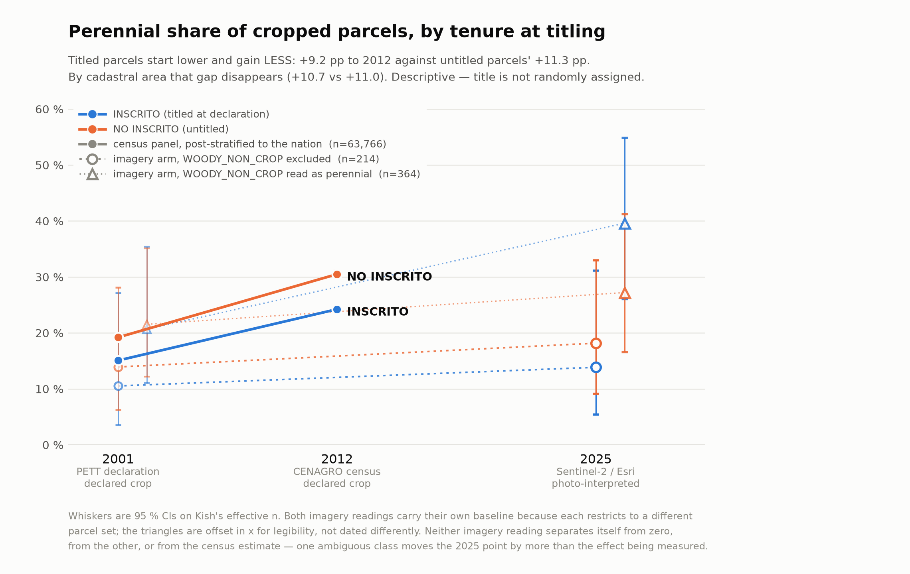

# Peru crop classifier

**Has Peruvian farmland shifted from domestic annual crops to export perennials — and does
secure legal title cause it?**

Peru's land-titling programme recorded, for about a million parcels, the crop growing there
**and** the parcel boundary, mostly between 1997 and 2006. It never went back. Satellite imagery
exists for every year since 1996. This repository joins those two facts into a land-use
classifier, and then tries to read change out of it.



---

## What the answers are

**The shift is real and large.** Between ~1999 and 2012, on 63,766 parcels linked across all 14
departments, perennial crops go from **16.5 % to 26.4 % of parcels (+9.9 pp)** and from
**21.0 % to 33.5 % of cadastral area (+12.5 pp)**. Gross flows are 3.9 : 1 toward perennials, so
it is not a net figure hiding offsetting churn. There is **no satellite and no classifier
anywhere in that measurement** — it is two official declarations of the same land.

**Title does not appear to cause it.** Titled parcels shifted *slightly less* (−2.1 pp ± 0.6),
and counting hectares rather than parcels the gap disappears entirely (+0.3 pp). A two-period
difference-in-differences over 14,625 parcels returns a **bounded null**: −0.0011
[−0.0126, +0.0104]. Titling moves predicted perennial probability by less than ±1.3 pp.

**The classifier works for a single year and not for a time series.** Sentinel-2, 3 classes,
865 photo-interpreted parcels: **0.774 macro-F1 on a locked test**, 0.724 held out of an entire
unseen department. Four separate attempts to turn it into a per-parcel trend all failed
pre-registered gates, for measured reasons.

Numbers of record, with intervals and caveats: [`docs/RESULTS.md`](docs/RESULTS.md).

---

## Run something in two minutes

```bash
uv sync                                                  # Python 3.11, from uv.lock
uv run cc -w demo train --model lightgbm --run-name demo
uv run cc -w demo evaluate runs/demo/demo
```

That works on a fresh clone with **no data and no Earth Engine account**. `data/demo/` is a
real 1,302-parcel sample over six departments, committed for exactly this — and it already shows
the thing this repository is mostly about: cross-validation says **0.538**, holding out a whole
department says **0.494**.

```bash
uv run cc -w demo evaluate runs/demo/demo --tag demo    # CV and LODO side by side
```

⚠️ It is a *stratified* sample, so no share or prevalence computed from it means anything. The
full archive is licensed and not redistributable — see [`docs/DATA_ACCESS.md`](docs/DATA_ACCESS.md).

```bash
uv run cc workspaces        # where everything resolves on your machine, and what exists
uv run cc --help
```

---

## How to do things

| | |
|---|---|
| [`docs/howto/01_setup.md`](docs/howto/01_setup.md) | install, `workspaces.yaml`, Earth Engine auth |
| [`docs/howto/02_get_satellite_data.md`](docs/howto/02_get_satellite_data.md) | pulling imagery, and ⚠️ **the three ways Earth Engine fails silently** |
| [`docs/howto/03_new_label_set.md`](docs/howto/03_new_label_set.md) | add a label set — a YAML file, no Python |
| [`docs/howto/04_train_and_evaluate.md`](docs/howto/04_train_and_evaluate.md) | train on either label set, and ⭐ **why CV alone is not a verdict** |
| [`docs/howto/05_perennial_change_by_tenure.md`](docs/howto/05_perennial_change_by_tenure.md) | the headline analysis, three routes to it, and what is closed |

---

## ⭐ The one thing to know before you model anything

`centroid_lat` — a parcel's latitude — is worth **+0.047 macro-F1 on cross-validation** and
**−0.060 when the department changes**.

Spatial CV holds out 5 km blocks *inside departments the model has already seen*. It cannot tell
signal from spatial memorisation, and neither can leave-one-year-out. **Never select a feature or
a model on CV alone.** `cc evaluate` prints CV, LODO, LOYO and LODYO together, each beside its
majority-class floor, so that the comparison that decides is the one on screen.

The same lesson caught three different things: `frac_l7` manufactured *change*, static features
manufactured *stability*, `centroid_lat` manufactured *accuracy that does not leave the training
departments* — and then an entire **architecture** did it too. LTAE wins Sentinel-2 CV in 8 arms
of 8 and loses LODO in 4 of 4.

More of these: [`docs/LESSONS.md`](docs/LESSONS.md), which is the most portable thing here.

---

## The data, in one paragraph

Three files chain into the training set, and the middle one is mandatory:

```
BD SSET (crop, year) ──CodigoSSET──► Grafica_Tabular ──COD_PREDIO──► QGIS polygons
```

`Grafica_Tabular` is the only file carrying **both** keys, fifteen of them exist, Callao yields
nothing — so **14 departments are linkable and that is structural**. There are no sierra or
selva labels and there never will be. A fourth dataset, the 2012 agricultural census, links only
by the farmer's *name*, in unlabelled columns.

⚠️ There are **four silent data traps** — zero-padded keys, 19 shapefiles shipping their
attribute table under the wrong basename, one 3D cadastre that Earth Engine rejects outright,
and departments whose rows are not in "their" workbook. Every one returns a plausible **empty or
column-less result instead of an error**. Read raw data through `allperu.sources`, which handles
them; each is pinned by a test. [`docs/DATA.md`](docs/DATA.md).

---

## Reference

| | |
|---|---|
| [`docs/STATUS.md`](docs/STATUS.md) | what is done, what is closed, what to do next |
| [`docs/RESULTS.md`](docs/RESULTS.md) | every strand, its verdict, the numbers of record |
| [`docs/LESSONS.md`](docs/LESSONS.md) | ⭐ what generalises beyond this project |
| [`docs/DATA.md`](docs/DATA.md) | datasets, linkage chains, the four traps |
| [`docs/DATA_ACCESS.md`](docs/DATA_ACCESS.md) | how to obtain the data, and what runs without it |
| [`docs/PIPELINE.md`](docs/PIPELINE.md) | module reference |
| [`docs/s2_labelling/`](docs/s2_labelling/plan.md) | the photo-interpretation campaign + codebook |
| `reports/peru_report.tex` | the written-up narrative (PDF beside it); earlier snapshots in [`reports/archive/`](reports/archive/REPORT.md) |
| [`docs/repo_layout.md`](docs/repo_layout.md) | why the repository is shaped like this |
| [`CLAUDE.md`](CLAUDE.md) | orientation for a coding agent |
| `src/crop_classifier/archive/` | ⛔ closed routes, and which gate killed each |

Contributing: [`CONTRIBUTING.md`](CONTRIBUTING.md). Licence: [`LICENSE`](LICENSE) covers the
**code only** — the data is not redistributed and is not covered by it.
