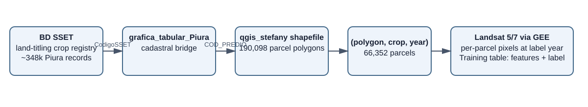
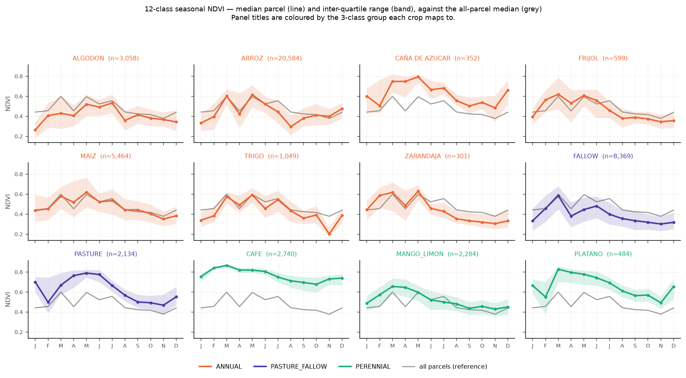
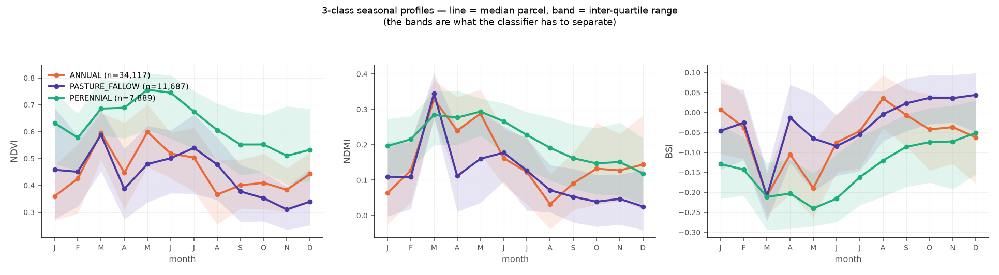
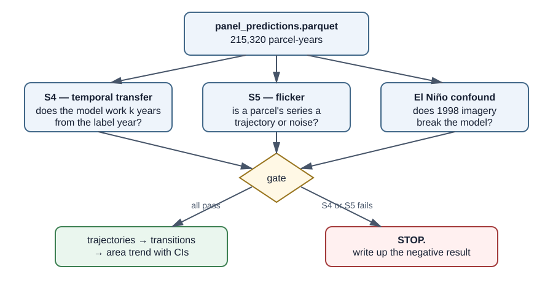
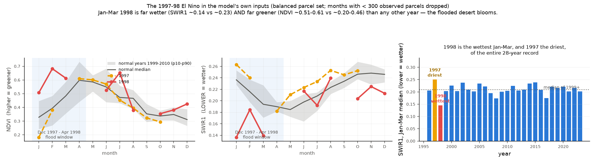
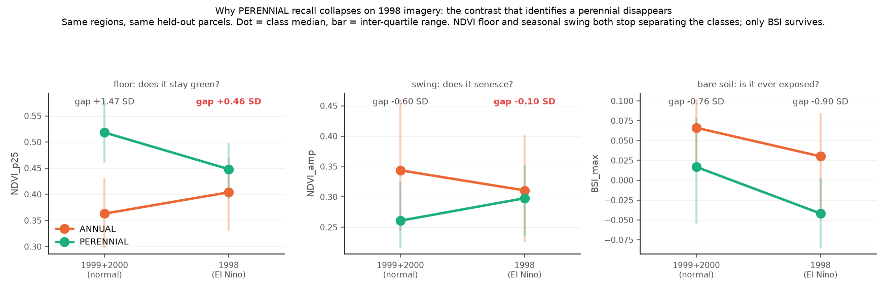
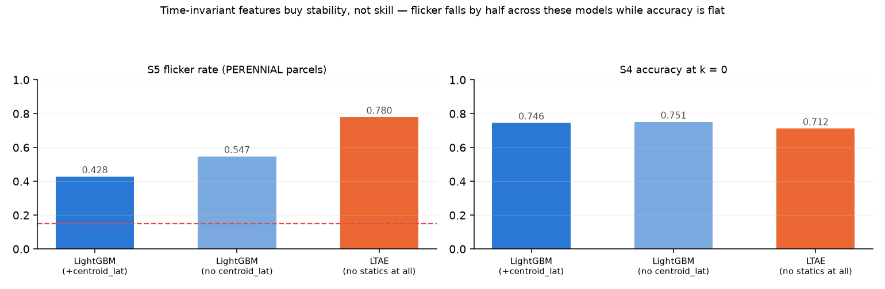
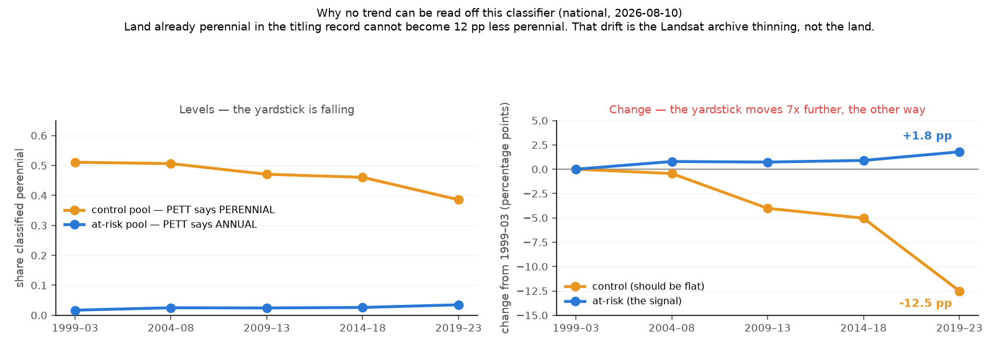
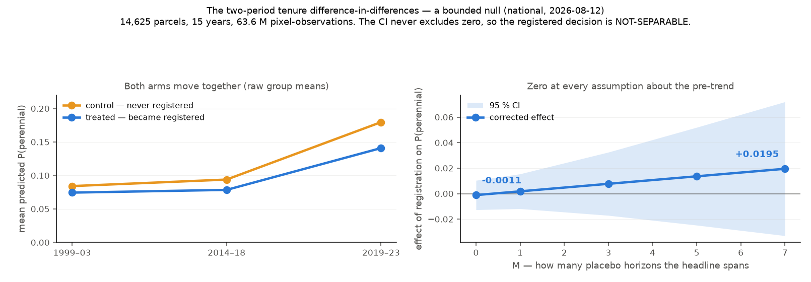

# Peru crop classification — what was built, what was tested, and where it stands

> The short version of the modelling work: a crop classifier built from land-titling records
> and Landsat imagery, four successive attempts to turn it into a measure of agricultural
> change, and what each attempt showed.
>
> This is the human-facing narrative. The numbers of record, per strand and with verdicts, are
> in [`RESULTS.md`](RESULTS.md); the current state and next actions are in
> [`STATUS.md`](STATUS.md).
>
> Last updated **2026-08-12**, after the two-period tenure difference-in-differences returned
> the project's first actual estimate. ⚠️ It therefore predates the S2 labelling campaign
> being built — see [`s2_labelling/plan.md`](s2_labelling/plan.md) for that.

---

## 0. In one page

**The question.** Has farmland in Peru shifted from domestic annual crops (rice, maize, beans)
to export perennial crops (mango, lime, coffee, banana)? And does giving a farmer secure legal
title to their land make that shift more likely?

**What we have.** Peru's land-titling programme recorded, for roughly one million parcels, the
crop growing there and the parcel's boundary — but only **once**, when the parcel was titled,
mostly between 1997 and 2006. There is no second visit. Satellite imagery, by contrast, exists
every year from 1996 to 2023.

**What works.** A classifier that looks at one year of Landsat imagery over a parcel and says
whether it is perennial, annual, or pasture/fallow. It scores **0.681 macro-F1** on a held-out
test set in Piura and **0.628** nationally — good for a single year.

**What does not work.** Running that classifier over every year and reading the change. Four
successive designs were tried (§3–§6) — the annual panel, five-year windows, a round of
attempted fixes, and finally the titling comparison. The first three failed for the same
underlying reason: **the classifier's output drifts over time for reasons that have nothing to
do with the land**, and the drift is larger than the change being looked for.

**What we ended up with.** One design survived — a difference-in-differences comparing parcels
that gained legal title against parcels that did not. It gives a **bounded null**: becoming
registered changes predicted perennial probability by less than **±1.3 percentage points**
against a ~7 % baseline. Not a discovery, but a real, defensible number with a confidence
interval — the first in the project.

**What is next.** One route remains, and it is the only one that *checks* the classifier rather
than working around it: **hand-label 1,500–3,000 parcels on recent high-resolution imagery**.
Every accuracy figure in this document is measured in ~1997–2006. Not one is measured in
2019–2023, which is the only period the research question is about. See §7.

---

## 1. The data, and the shape of the problem



The chain is: a crop registry (free text, one row per declaration) → a cadastral bridge file
that carries both key systems → parcel polygons. All three are needed, because the registry has
no polygon id and the polygons have no registry id.

**Nationally: 14 linkable departments, 946,872 parcels with both a crop and a boundary.** Only
15 of 24 departments have a bridge file, and Callao yields nothing, so 14 is structural rather
than a choice. The working sample is **56,419 parcels** drawn as whole 5 km blocks.

Three features of the labels shape everything that follows:

1. **They are a single snapshot.** A parcel is observed once. So the data trains a *"what is
   this parcel now?"* model, not a change model. Measuring change means applying the model to
   years it was never trained on and hoping it transfers.
2. **Neighbouring parcels grow the same crop.** ~86 % of adjacent parcels share a crop, against
   ~46 % if crops were placed randomly. A random train/test split would therefore leak: the
   model would "recognise" a test parcel by having memorised its neighbour. Every split in this
   project is blocked by **contiguous 5 km regions with a 1.5 km buffer**.
3. **Titling year is entangled with crop.** Parcels titled in 1998 are 0.4 % perennial; parcels
   titled in 2000 are 33.8 %, because the campaign reached different regions in different
   years. Year, place and label are confounded from the start.

---

## 2. The classifier

### 2.1 Three model types

| model | what it sees |
|---|---|
| **LightGBM** | 140 whole-year summary numbers per parcel — percentiles, seasonal amplitude, harmonic fits over 6 Landsat bands and 5 vegetation indices, plus parcel area and latitude. |
| **LTAE** | The raw time series: per-date parcel-median reflectance with a validity mask, read by an attention network. No summary features, no location. |
| **PSE-LTAE** | The same, but keeping 8 individual pixels per date so within-parcel texture is visible. |

### 2.2 Twelve crop classes does not work


Best model **0.427 macro-F1** (LTAE) on 49,648 parcels. Rice scores 0.751 and coffee 0.698;
maize 0.228, banana 0.197, sugarcane 0.147, beans 0.114.

The reason is visible in the seasonal curves:



At 30 m resolution over parcels averaging ~0.5 ha — about five pixels — maize, beans, cotton
and sugarcane look the same. Rice is separable because it floods; coffee because it keeps its
canopy all year. **The distinction the imagery actually carries is not crop species, it is
whether a parcel stays green year-round.**

### 2.3 Three land classes does work

Regrouping into `PERENNIAL` / `ANNUAL` / `PASTURE_FALLOW` keeps **56,419 parcels**, including
rare and mixed crops that the 12-class problem had to discard.



Between August and December, perennial parcels sit at NDVI 0.50–0.60 while annual and
pasture parcels fall to 0.31–0.44. Bare-soil index tells the mirror-image story. The
distributions overlap, so any single parcel can be wrong, but the average signal is clear.

| | Piura | national (14 depts) |
|---|---:|---:|
| pooled cross-validation macro-F1 | 0.652 | 0.628 |
| **locked-test macro-F1** | **0.681** | *unspent* |
| accuracy | 0.748 | — |
| `PERENNIAL` F1 / ROC AUC | 0.769 / 0.937 | 0.655 / — |

*(The national 0.628 is the best-scoring variant on cross-validation. It is not the model that
was selected — see §2.4, which is the whole point of that section.)*

Macro-F1 rises from 0.427 to 0.652 by asking an easier and more relevant question. Nationally
the class profile is far more even (`PASTURE_FALLOW` 0.485 → 0.606, because the sierra supplies
grazing land Piura lacks) and fold-to-fold variance falls about threefold.

**The national held-out test set has never been used.** It is being kept for a design that
earns it.

### 2.4 The one national result that changed how everything is evaluated

With 14 departments the model can be tested on a *place* it has never seen —
**leave-one-department-out (LODO)** — rather than on a neighbouring 5 km block.

| | cross-validation (unseen block) | LODO (unseen department) |
|---|---:|---:|
| with `centroid_lat` | **0.628** | 0.417 |
| **without `centroid_lat`** ⭐ selected | 0.581 | **0.477** |
| difference | **−0.047** | **+0.060** |

**Latitude helps by +0.047 when the test is a nearby field and hurts by −0.060 when the test is
a new department.** In Peru, latitude is almost a climate-zone label, so it looks like real
agro-climatic information — but the model uses it as a lookup table ("parcels near −5.2° are
mango"), and lookup tables do not travel. **12 of 14 departments improve when it is removed.**

This is the third time the same thing has happened in this project. An acquisition-metadata
feature (`frac_l7`) manufactured apparent *change*; latitude manufactured apparent *stability*
in the panel (§3.2); here it manufactures *accuracy that does not leave the training region*.
Each was invisible to the headline metric of its day.

**The general lesson, which later saved the project from a wrong model choice: an
out-of-distribution test is only blind along the axis it holds fixed.** Leave-one-*year*-out
holds place roughly fixed, so latitude is worth the same +0.047 there as in ordinary
cross-validation. Only holding out department **and** year at once (LODYO, free — it re-scores
existing predictions) reveals it as worth −0.005. Every candidate model is now scored on all
four.

---

## 3. Attempt 1 — predict every year for every parcel

Apply the single-year classifier to each of 1996–2023 and read each parcel's trajectory.
Piura: 7,690 parcels × 28 years = **215,320 parcel-years**. Nationally: 4,565 × 25 =
**114,125**, from 37.6 M pixel-observations.

Two gates had to pass before any trend could be believed.



- **S4 — temporal transfer.** Score a parcel against its known label in nearby years. A
  perennial in 1998 should still read perennial in 1996 or 2001. Criterion: within 0.10 of
  label-year accuracy for |k| ≤ 3.
- **S5 — flicker.** Count how often a parcel's class changes over the panel. Real land
  conversion happens once or twice in 28 years. Criterion: under 15 % of perennial parcels
  flickering.

**Both failed in Piura. S5 failed nationally on all three models.**

| model | time-invariant features | S4 (national) | flicker, criterion 0.15 |
|---|---:|---|---:|
| LightGBM (with latitude) | 3 | PASS | **0.517** ⛔ |
| LightGBM (no latitude) ⭐ | 2 | PASS | **0.744** ⛔ |
| LTAE (none at all) | 0 | FAIL | **0.980** ⛔ |

### 3.1 The El Niño (Piura only, but it explains the shape of the failure)



Piura's 1997–98 El Niño brought flooding and extraordinary greening. Panel-wide Jan–Mar NDVI
was 0.51–0.61 in 1998 against 0.33–0.45 in normal years. That is also when ~80 % of Piura's
labels were recorded.

A controlled test — same regions, train on 1999–2000, test on held-out 1998 parcels — shows
what it does:

| class recall | normal-year control | 1998 |
|---|---:|---:|
| `ANNUAL` | 0.833 | 0.908 |
| `PASTURE_FALLOW` | 0.626 | 0.142 |
| **`PERENNIAL`** | **0.544** | **0.016** |

Perennial detection goes to essentially zero. LTAE does the same thing (0.660 → 0.033), so it
is the imagery, not the model.



**Why:** a perennial parcel is identified by a *contrast* with its annual neighbours — greener
floor, flatter season. The flood erased the contrast from both sides. The NDVI-floor gap fell
from **+1.47 SD to +0.46 SD** and the seasonal-swing gap from −0.60 SD to −0.10 SD. Only
bare-soil index held up (−0.76 → −0.90 SD), and it carries only 6.5 % of the model's weight.

### 3.2 But the El Niño was not the real problem

The national panel starts in 1999, has no El Niño in its baseline, has no thin-coverage years
(minimum 93.4 % parcel coverage across 25 years), and spreads its labels over 1997–2006.
**S4 passes. S5 still fails, harder — 0.517 to 0.980.**



*(Figure shows the Piura panel, where the pattern was first seen: 0.428 / 0.547 / 0.780. The
national run reproduced it one rung worse at every step.)*

And flicker turned out to be **monotone in how much time-invariant information a model
carries** — a prediction registered in writing before the national run, and confirmed exactly.
A feature that does not change by year cannot produce a class change, so latitude makes a
trajectory mechanically flatter. Meanwhile **single-year accuracy barely moves** across those
three models (0.586 / 0.544 / 0.581). Static features buy almost nothing in being right and
almost everything in not changing your mind — so LTAE's **0.980 is the honest number** and
LightGBM's 0.517 is the flattered one.

**Conclusion:** ruling out the baseline years, coverage, the sensor change and the
architecture leaves one explanation. **A classifier at ~0.55–0.59 accuracy per year is not
accurate enough for a 25-year per-parcel trajectory.** Errors in different years are nearly
independent, so the sequence is dominated by classification noise. No trajectories, transitions
or area estimates were produced, and the code that would produce them stays unrun.

---

## 4. Attempt 2 — stop predicting trajectories, use 5-year windows

If annual predictions are too noisy, average them. Group years into five-year windows
(1999–03, 2004–08, …, 2019–23), average the predicted *probability* within each window, and
compare windows.

**The averaging works.** Annual flicker of 0.75 collapses to **8.8 % of parcels changing
window-state twice or more**; 82 % never change at all.

**The comparison does not.** The design needs a yardstick: parcels the titling record already
calls `PERENNIAL` should stay perennial, so any movement in that group is measurement error.



The control pool falls **12.5 percentage points** while the at-risk pool rises **1.8**. The
yardstick moves
seven times further than the signal, in the opposite direction. It is not composition — parcels
present in all five windows give the same curve — and it happens on every model arm
(−0.044 / −0.059 / −0.103 per decade).

**Part of the mechanism was measured.** Clear Landsat observations per parcel-year fall from
~24 to ~13 as Landsat 5 retires and Landsat 7's scan-line corrector fails. Within a parcel,
predicted probability tracks that count: **+0.052 per log-observation on true perennials,
−0.022 on true annuals** (p < 1e-6). Both classes revert toward the average as evidence thins,
which at the level of a share is indistinguishable from real conversion. It explains 0–29 % of
the drift.

---

## 5. Attempt 3 — fix the drift

Four mitigations were tried against the drift. All were measured rather than assumed, and the
negative results are the useful part.

| what was tried | result |
|---|---|
| **Better model** — degradation augmentation + withholding the 10 most year-identifying features | Adopted (`lightgbm_nometa_nolat_aug_yleak10`), better on all five criteria, control drift −0.059 → **−0.038**. But **no single difference is statistically significant**; adopted for consistent sign at zero cost. Target was 0.01. ⛔ |
| **Recalibration** — rescale probabilities by observation density | ⛔ Closed. Fitted temperature *falls* as density falls, so at low density the model is **over**-confident and the correct fix pushes probabilities *further* toward the average. Applying it moved the drift by 0.0001. |
| **Quantile alignment** per year | ⛔ Worse than doing nothing — drift −0.1023, nearly double the baseline. |
| **Admit Landsat 8/9 (OLI)** to restore observation density | ⛔ Closed, twice. OLI would give 21.8 clear observations against L7's 13.1 — the largest available lever. But it shifts the control pool by −0.042; the published Roy harmonisation makes that **−0.107**; and refitting the correction on 27,573 same-day L7/OLI parcel pairs of our own cannot even identify a slope (the sensors' *difference* is noisier than either sensor's values). The best possible version still overshoots. **The reason is structural: OLI reads +0.070 NDVI greener on perennial parcels and +0.045 on pasture, and no global linear correction can remove a difference that depends on cover type.** |

Two diagnostic findings from this round are worth carrying:

* **The features identify a parcel's label year at 0.508 accuracy against a 0.155 baseline**,
  even when held out by region. `frac_l7` was one symptom of a systemic property.
* **Leave-one-year-out fails on the leg that matters.** Worst non-1998 cohort **0.406** against
  cross-validation 0.581; `PERENNIAL` recall ranges 0.370–0.882 by year. **A 2019–23 prediction
  was never licensed by any evaluation the project had run.**

---

## 6. Attempt 4 — the tenure difference-in-differences ⭐ the one that returned a number

### 6.1 The idea

Every earlier design needed the classifier to deliver a trustworthy *level* or *trend*, and it
cannot. This design stops trying and changes the **comparison** instead.

The bridge file turned out to carry a **second dated observation of registration status** — the
cadastre's own `estado` and its cut date around 2011 — alongside the titling declaration's
status from ~1997–2006. That gives **1.78 M parcels two dated tenure observations**, with
**8.6 % moving from unregistered to registered**.

So: take parcels that were unregistered when declared, split them by whether they became
registered by 2011, and compare how their predicted perennial probability changes. The
classifier still supplies the outcome, drift and all — **but the drift is now common to both
groups and subtracts out.** Restricting to parcels declared as annual crops makes both arms
start at the same ~7 % baseline, so even the class-specific part of the drift applies equally.

**Definitions, since the terms matter:**

- **Treated** — unregistered at declaration, registered by the ~2011 cadastre. 6,559 parcels
  after all restrictions. That is not a sample: it is every qualifying parcel in Peru.
- **Control** — unregistered at *both* observations. 8,066 parcels.
- **Headline** — the difference between the two groups in how much they changed from 1999–2003
  to 2014–2023.
- **Placebo** — the same comparison run entirely *before* anyone was treated. It should be
  zero; if it is not, the two groups were already diverging and the headline is contaminated.

### 6.2 The gate, which is where all the informative failures were

Version 2 of this study demanded *proof* that the pre-trend was negligible, via an equivalence
test. That needed 25,202 parcels per arm; all of Peru has 6,559. **The study was closed before
any satellite budget was spent.**

Version 3 changed the gate, not the design. The standard alternative is to **measure the
pre-trend and subtract it**, carrying its uncertainty forward:

```
corrected = headline − M × placebo        se = √(se_headline² + M² × se_placebo²)
```

**M** is how many placebo-lengths the headline spans — a 17.5-year headline over a 2.5-year
placebo gives **M = 7**. It is derived from the window midpoints in code, not typed in. Because
the placebo's uncertainty is multiplied by 7, the correction widens the interval about 4.5-fold.
The decision rule, outcome, contrast and a **sensitivity curve over M ∈ {0,1,3,5,7}** were all
written to a registration file **before extraction**, and the file refuses to be edited.

*A note that generalises:* v1 of this gate paired an equivalence bound with "the interval
contains zero" — those pull opposite ways, so it **rewarded imprecision**. v2 was a proper
equivalence test which, once the placebo was finally measured, turned out to be **unpassable at
any sample size** (the point estimate sits outside the band, so the standard error needed is
negative). A pre-trend gate should ask *"could this pre-trend overturn my conclusion?"* — which
the sensitivity curve answers directly, and lets the reader pick their own assumption.

### 6.3 The result

**14,625 parcels, 15 years extracted (211,567 parcel-years, 63.6 M pixel-observations, ~13.5
hours), 219,375 parcel-years inferred.** The placebo was estimated first, enforced by the code
path.



| | coefficient | standard error | 95 % interval |
|---|---:|---:|---|
| **Placebo** (1999–2000 → 2001–03) | **−0.0029** | 0.0037 | [−0.0103, +0.0044] |
| **Headline** (1999–03 → 2014–23) | **−0.0011** | 0.0059 | **[−0.0126, +0.0104]** |
| **Corrected at M = 7** | +0.0195 | 0.0268 | [−0.0330, +0.0720] |

**Decision: NOT-SEPARABLE — and that is a complete result, not a failure.**

Read plainly:

* **There is no anticipation.** The placebo is essentially zero, so the reverse-causality story
  — farmers who were already switching to export crops going and getting titled — has no
  support in the data. This was worth knowing on its own.
* **The headline is a tight null.** Becoming registered moves predicted perennial probability by
  less than **±1.3 percentage points** against a ~7 % baseline. This is a *bound*, not an
  absence of evidence.
* **The correction cannot rescue a large effect.** It widens ±1.3 pp to ±5.3 pp. Any effect
  above about 3 pp would have survived it; none was there to survive.
* **Never read a direction from the corrected estimate.** It is +0.0195 on probability and
  −0.0230 on the thresholded share, because the placebo's sign flips between the two — which is
  what a noise term does.

### 6.4 What limits it

* **⚠️ The control group is contaminated after 2011.** Tenure is last observed at the cadastre
  cut; the outcome runs to 2023 and Peru's titling programme did not stop. An unknown share of
  controls was titled and is invisible here. That pushes any real effect **toward zero**, so
  this null is **not** evidence that titling has no effect.
* **⚠️ The magnitude depends on the architecture, though the sign does not.** LTAE gives
  −0.0154 against LightGBM's −0.0011. All arms agree in sign and all are NOT-SEPARABLE, but no
  precise magnitude can be quoted.
* **Where it applies.** 75 % of qualifying treated parcels are in La Libertad and Cajamarca,
  because that is where the titling campaigns ran. Parcel fixed effects absorb this, so it
  limits generalisation rather than the estimate.
* **Perennial ≠ export** (57 % export / 20 % mixed / 23 % domestic), so the export-discounted
  corrected coefficient is +0.0112, interval [−0.0189, +0.0413].

### 6.5 The obvious simpler comparison, and why it is not an estimate

The design one would reach for first — compare parcels *already* titled against never-titled,
and read the perennial share at each end — was computed as a **descriptive companion**. The gap
runs **−0.0429 in 1999–03 → −0.0216 in 2019–23**; the within-parcel version of that change is
**+0.0055 ± 0.0239**, a null.

Three measured reasons not to read it as an effect:

1. **The 1999–03 gap *is* the classifier's error rate, not the land.** These parcels were all
   declared as annual crops, so the true perennial share is ~0 and the whole gap is false
   positives. It comes out at −0.0429 against an independently measured false-positive-rate gap
   of −0.044 — the same number reached from a completely different direction.
2. **The sign is department-specific.** Titled parcels read *higher* perennial in 5 of 14
   departments and lower in 9. A pooled figure names a quantity that does not exist.
3. ⚠️ **An earlier Piura figure — "24.9 % of titled parcels read perennial vs 10.9 % of
   untitled" — does not replicate.** Piura's gap in the national panel is −0.081, the opposite
   direction. It should not be carried forward.

Making this design usable needs an **endpoint error matrix broken down by tenure group**, not a
bigger sample — the pool here is 363,529 parcels, about 55× the DiD's. Which is §7.

---

## 7. Where this stands, and the one route left

### Solid

- **A single-year 3-class classifier**: 0.681 macro-F1 on Piura's locked test, 0.628 nationally,
  perennial ROC AUC 0.937.
- **A bounded null on titling**: |effect| < 1.3 pp uncorrected, < 5.3 pp after the pre-trend
  correction, with no anticipation.
- **A reusable evaluation discipline**: report cross-validation, leave-one-department-out,
  leave-one-year-out and leave-one-department-and-year-out for every candidate, because each is
  blind along the axis it holds fixed.
- **A feasibility method**: required sample from measured variance versus available sample from
  the archive, computable in minutes — which is what stopped the wrong version of the DiD before
  it spent anything.
- **281 tests pass.** The national locked test is **still unspent**.

### Not solid

Per-parcel annual trajectories, conversion dates, and any area or trend estimate anchored on
the classifier's absolute level. That code is written and unit-tested and stays unrun.

### ➡ The next step: photo-interpret endpoint labels

[`s2_labelling/plan.md`](s2_labelling/plan.md) — **since built; only the human labelling
remains.**

**Every accuracy number in this document is measured at the label year, ~1997–2006. Not one is
measured at the endpoint, 2019–2023, which is the only period the research question is about.**
Everything said about the endpoint is extrapolation, and leave-one-year-out says that
extrapolation was never licensed.

Every cheaper route has now been tried and measured: restricting the baseline years, changing
architecture, changing the estimand to windows, density matching, recalibration, feature
pruning, quantile alignment, admitting Landsat 8/9 twice, and the tenure DiD twice. Each was
an attempt to *work around* an unverified classifier. **Hand-labelling is the only remaining
task that verifies it.**

The design: **1,500–3,000 parcels** on recent sub-metre imagery, stratified by department ×
predicted class × tenure, labelled **blind to the model's prediction**, with `UNSURE` and
`NOT_AGRICULTURE` as permitted answers and a 10 % double-labelled subsample for an inter-rater
score. The viewer already exists — `notebooks/04_inspect_parcel_basemaps.ipynb` draws a parcel
and its neighbours on three basemaps — and it needs a work queue and a response store, not a
rewrite. Neighbour context must stay, because perennial detection is a *contrast*, not a level.

It produces four things nothing else can:

1. **The project's first endpoint test set** — an honest answer to "how good is this model in
   2019–23?"
2. **An endpoint error matrix**, which is what a bias-corrected area estimate needs.
   `perennial/area.py` is built and has never been usable without it.
3. **A direct check** of whether the classifier's errors differ by tenure group at the endpoint
   — currently verified at ~1999 and *assumed* at 2019–23, a caveat attached to every tenure
   result above. Stratifying on tenure makes this free.
4. **A validated outcome for the DiD**, turning a predicted outcome into a measured one on the
   labelled subset.

**Cost: about 35 hours of human attention** at ~1 min/parcel for 2,000 parcels, plus 200 for the
inter-rater check. No satellite budget, no model training. It is the cheapest task in the
project in compute and the most expensive in attention, which is exactly why it keeps being
deferred — and it is the only one that would let anybody state an endpoint number and defend it.

---

## Reproducing the figures

```bash
uv run python -m crop_classifier.perennial.report_figures     # §2, §3 figures
uv run python -m crop_classifier.allperu.report_figures       # §4, §6 figures
```

Both read only persisted artefacts under `data/processed/` — no satellite calls, no model
training.
