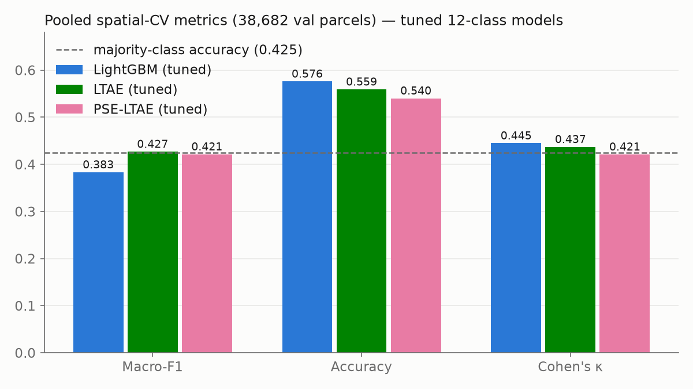
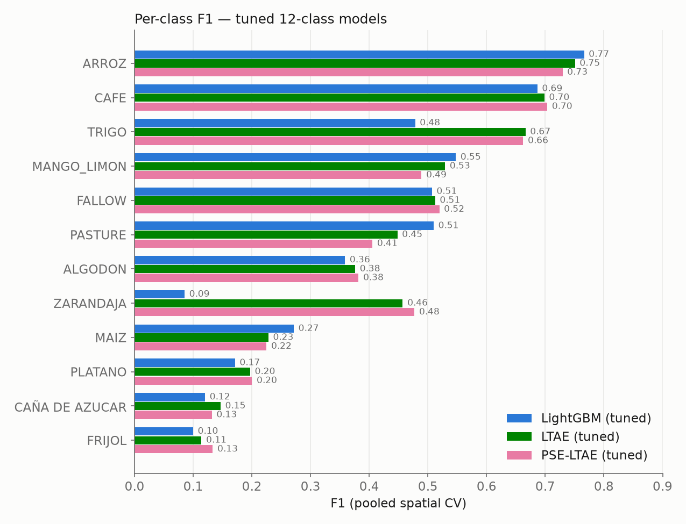
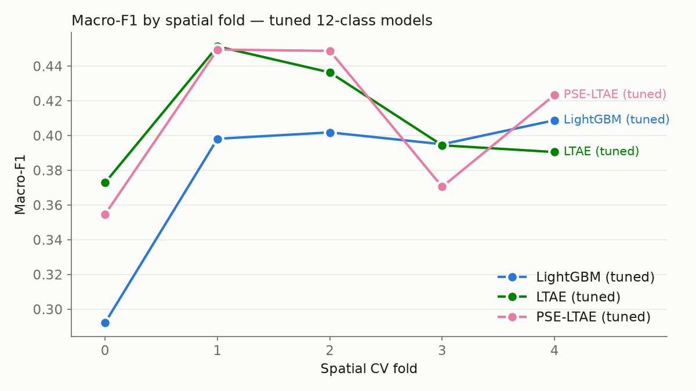

# Piura crop classifier — project summary

*One-page status as of 2026-07-30. For the full pipeline reference see [`PIPELINE.md`](PIPELINE.md);
for the upstream data forensics see [`../CLAUDE.md`](../CLAUDE.md) and [`DATASETS.md`](DATASETS.md).*

> **⚠️ This page covers the 12-class strand only, and it is no longer the whole project.**
> Two further strands started after it was written:
>
> * the **3-class perennial/annual/pasture** classifier and its 28-year panel — **the panel
>   failed validation** ([`perennial/RESULTS.md`](perennial/RESULTS.md) §7);
> * **all of Peru** (2026-08-07/09) — 14 departments, 946,872 linked polygons
>   ([`all_peru/RESULTS.md`](all_peru/RESULTS.md)), which produced the result that most
>   affects how models here should be *selected*: **`centroid_lat` is worth +0.047 macro-F1
>   on spatial CV and −0.060 on leave-one-department-out.** Spatial CV holds out 5 km cells
>   inside departments the model has already seen, so it cannot separate spatial
>   memorisation from signal. **Its panel then failed the same gate the Piura one did**
>   (2026-08-09) — three model arms, all failing flicker at 0.517 / 0.744 / 0.980 — so no
>   national trend exists either.
>
> Two cautions that carry back to the 12-class work here:
> **(1) an architecture with no static features is not automatically more generalisable** —
> LTAE lost leave-one-department-out to LightGBM nationally despite carrying none
> (`all_peru/RESULTS.md` §6.2c); **(2) CV rank, LODO rank and locked-test rank have now come
> out as three different orderings**, so choose the estimator that matches the intended use
> before comparing models.
>
> For the current state of everything, read **[`SUMMARY_FULL.md`](SUMMARY_FULL.md)**. The
> 12-class numbers below are still correct and its locked test set is still unspent.

## What this is

A crop classifier for smallholder parcels in **Piura, Peru**. Each training example is one farm
**polygon** with a **declared crop** and a **titling year**, taken from legacy PETT land-titling
records; the features are a **Landsat satellite time series** for that parcel in that year. The task
is single-label classification over 12 crop / land-cover classes.

## The satellite

**Landsat Collection-2, Level-2 surface reflectance**, pulled per parcel-year from Google Earth
Engine. The declared-crop years run **~1998–2007** (the bulk are 1998–99), so the usable missions are
**Landsat 5 (TM)** and **Landsat 7 (ETM+)** at **30 m** resolution — Sentinel-2 (2015+, 10 m) is too
recent to year-match these labels and is not used. Six reflectance bands (B, G, R, NIR, SWIR1, SWIR2)
are harmonised across missions and augmented with five spectral indices (NDVI, EVI, NDWI, NDMI, BSI),
giving **11 channels** shared by every model. Clouds/shadows are masked via QA_PIXEL. A parcel must
have **≥ 4 clear acquisitions** in its crop year to be modelled (an abstain gate); parcels below that
threshold are never scored.

At 30 m over ~0.5 ha parcels the imagery is coarse — a typical parcel is only a handful of pixels —
which is the central difficulty of the problem.

## The label set (12 classes, 49,648 parcels)

Free-text crop declarations were normalised, intercrops resolved through a curated merge map (e.g.
coffee-shade systems → CAFE), fallow/pasture kept as land-cover classes, and rare/unusable classes
dropped (GIRASOL removed; MANGO + LIMON + MIXED_ORCHARD merged to **MANGO_LIMON**). The class
distribution is heavily imbalanced, which is why **macro-F1 (not accuracy) is the primary metric**.

| Class | Parcels | | Class | Parcels |
|---|--:|---|---|--:|
| ARROZ (rice) | 21,564 | | PASTURE | 2,210 |
| FALLOW | 8,734 | | TRIGO (wheat) | 1,162 |
| MAIZ (maize) | 5,809 | | FRIJOL (bean) | 617 |
| ALGODON (cotton) | 3,235 | | PLATANO (plantain) | 493 |
| CAFE (coffee) | 2,859 | | CAÑA DE AZUCAR (sugarcane) | 364 |
| MANGO_LIMON (mango/lime) | 2,298 | | ZARANDAJA (bean sp.) | 303 |

## The three models and their inputs

A capability ladder, all sharing the same 11 channels but consuming them at increasing granularity:

| # | Model | Input representation | What it does |
|---|---|---|---|
| 1 | **LightGBM** | 141 flat features per parcel — per-channel summary stats (median/mean/std/quantiles/amplitude), a linear slope, and an order-1 **harmonic fit** encoding phenology timing, plus statics (area, latitude, obs count) | Gradient-boosted trees; strong, cheap baseline |
| 2 | **LTAE** | per-date **parcel-median** sequence `[T=64, 11]` + day-of-year + validity mask | Lightweight Temporal Attention Encoder — masked temporal attention over the real irregular dates |
| 3 | **PSE-LTAE** | **pixel sets** `[T=64, P=8, 11]` (the 8 most-observed pixels per date) + masks | A pixel-set encoder (masked mean+std pooling) feeding the *same* LTAE core — isolates the value of within-parcel spatial texture |

All three output a probability over the 12 classes. LightGBM handles missing values natively; the
neural models are class-weighted and normalised on the training subset only.

## Training procedure

- **Spatially blocked cross-validation.** Crops in Piura grow in single-crop blocks (~86% of adjacent
  parcels share a crop), so random splits would leak. Parcels are gridded into 1 km blocks grouped
  into contiguous **5 km regions**; a **15% locked test set** is held out by whole regions, and the
  rest is split into **5 stratified CV folds** with **1.5 km buffered dead-zones** between train and
  validation to suppress neighbour leakage.
- **Objective.** Class-weighted cross-entropy (neural) / native multiclass (LightGBM); early stopping
  and model selection on **validation macro-F1**, not loss.
- **Hyperparameter tuning.** A 30-trial **Optuna** search per model (objective = mean 3-fold spatial-CV
  macro-F1, test set never touched), then the best config refit under the full 5-fold protocol.
- **The locked test set has never been evaluated** — reserved for a single final measurement of the
  chosen model.

## Results (tuned, 12-class, pooled spatial CV over 38,682 validation parcels)

| Model (tuned) | CV macro-F1 | Pooled macro-F1 | Accuracy | Cohen's κ |
|---|---|---|---|---|
| LightGBM | 0.379 ± 0.049 | 0.383 | **0.576** | **0.445** |
| **LTAE** | **0.409 ± 0.033** | **0.427** | 0.559 | 0.437 |
| PSE-LTAE | 0.409 ± 0.044 | 0.421 | 0.540 | 0.421 |

Majority-class baseline accuracy is **0.425** — all three models clear it. **Tuned LTAE is the best
model.** Two effects drove the gains: revising the label set (dropping the unlearnable GIRASOL,
merging the orchards) was worth ~+0.06 macro-F1 over the earlier 15-class runs, while hyperparameter
tuning added a further ~+0.01–0.02.

**Where the attention models win: rare classes.** LightGBM is marginally better on accuracy and on a
couple of head classes (MAIZ, PASTURE), but LTAE/PSE-LTAE substantially rescue the rare classes that
trees miss — ZARANDAJA F1 0.09 → 0.46–0.48, TRIGO 0.48 → 0.67. The head classes (ARROZ ~0.75, CAFE
~0.70) are strong for everyone. PSE-LTAE does **not** beat plain LTAE, so the pixel-set encoder is not
yet earning its extra cost on these tiny parcels.

**Regional difficulty.** One spatial fold (fold 0) is consistently the hardest region for all models
(macro-F1 ~0.29 for LightGBM, ~0.36 for the neural models) despite a normal class/year mix — genuine
geographic difficulty, and the honest error bar behind the ±0.03–0.05 fold spread.

## Status and next step

Milestone 3 is passed and the 12-class retrain + sweeps are complete. The remaining work is the
**single locked-test evaluation** of the chosen model (tuned LTAE), optionally preceded by the
`max_gap` training-filter ablation and temperature scaling of the neural probabilities (pooled Brier
≈ 0.22) if confidence-based abstention is wanted at inference.
