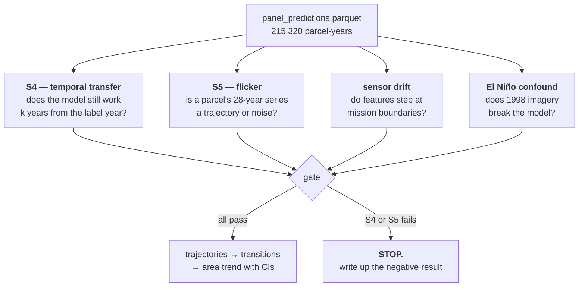
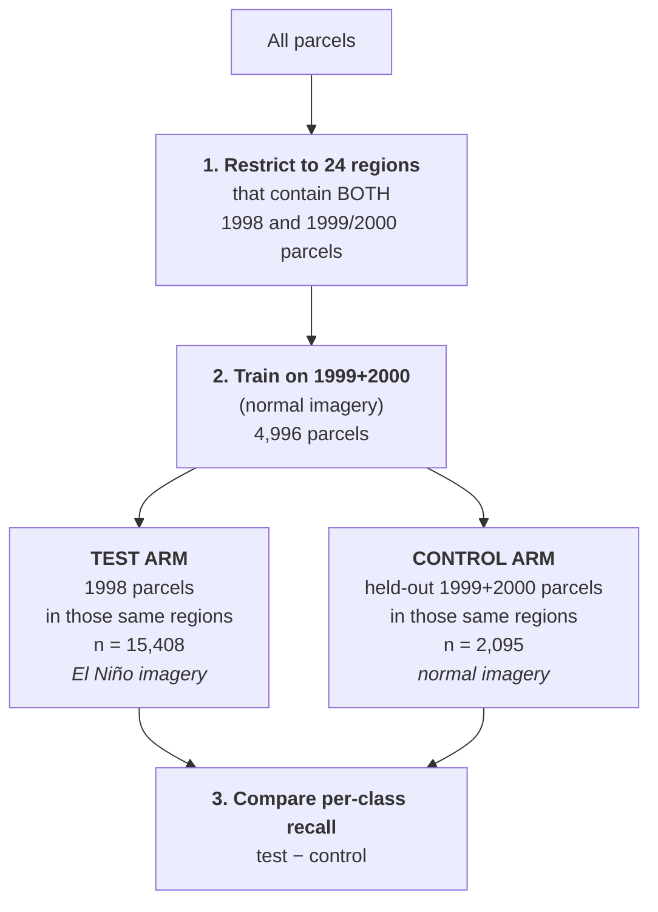

# Piura crop classification — what was built, what was tested, and why it does not yet work

> A complete account of the modelling work: the 12-class crop classifier, the move to a
> 3-class land-state classifier, model selection, the multi-year panel, and the validation
> gates that the panel failed. Every number here is measured. Companions:
> [`PIPELINE.md`](PIPELINE.md) (12-class code), [`perennial/RESULTS.md`](perennial/RESULTS.md)
> (3-class detail), [`perennial/plan.md`](perennial/plan.md) (the blueprint).
>
> Last updated 2026-08-10 (§11 — the **window pivot's three pre-gates also failed**, and the
> temporal out-of-distribution problem that underlies all of it). Earlier: 2026-08-09 (§10.4 —
> the **national panel failed the same gate**, and §10.1b — a static-free architecture did
> **not** fix transfer).

---

## 0. Summary

The research question is **"has land in Piura shifted from domestic annual crops to export
perennial crops?"** A per-parcel classifier was built, trained on ~1998 land-titling records
matched to Landsat imagery, and run over a 28-year satellite panel to detect that shift.
**The classifier works on a single year — 3-class macro-F1 0.681 on held-out parcels. The
28-year panel does not.** It failed both of its validation gates, under two completely
different model architectures, and it failed hardest exactly where the answer would come
from: the 1996–98 baseline years, which coincide with the catastrophic 1997–98 El Niño.
**No trend has been produced and none should be.** The perennial *signal* is real and
detectable; what fails is tracking *change* in it, parcel by parcel, year by year.

**2026-08-08 — the data is now national (§10).** 14 departments, 946,872 linked polygons,
label years spread 1997–2006. The single-year classifier holds up (0.628 vs Piura's 0.648)
with a much more balanced class profile, and leave-one-department-out — an evaluation Piura
could not run — showed that **`centroid_lat` is spatial memorisation, not agro-climatic
signal**: worth +0.047 on CV and −0.060 on unseen departments.

**2026-08-09 — the national panel has now been gated, and it fails the same way (§10.4).**
Three arms (two LightGBM, plus LTAE, which carries no time-invariant features at all) were
inferred over 1999–2023 and put through the Phase-7 gate. **All three failed S5 flicker**, at
0.517 / 0.744 / **0.980** against a 0.15 criterion — monotone in how many statics the model
carries, exactly as pre-registered from §7. So the conclusion of this document is **not a
Piura artefact**: it holds on 14 departments, on a panel with **no thin years** and **no
El Niño baseline**, where **S4 temporal transfer actually passes**. That combination is what
finally isolates the cause — see §10.4. **No national trend was produced either.**

---

## 1. Data overview


**The critical property: the labels are a single snapshot.** A parcel's crop was recorded
once, when it was titled — ~80% of them in 1998–99. There is no second observation. The
supervision signal is therefore *one year per parcel*, and every parcel's label year is also
the year of satellite imagery it was trained on.

That has three consequences that drive everything below:

1. **Only a "what is this parcel *now*" model can be trained**, never a "what changed" model.
   Change detection has to be done by *applying* the single-year model to every year, which
   assumes it transfers — an assumption that must be tested, not asserted.
2. **Registration year is confounded with the label.** Titling campaigns swept region by
   region, and different regions grow different things. 1998 parcels are **0.4% perennial**;
   2000 parcels are **33.8% perennial**. Year, region, and crop are entangled.
3. **1997–98 was the catastrophic Piura El Niño**, so the single most common label year is
   also the year with the most abnormal imagery in the entire record. §6 covers this.

---

## 2. Model 1 — the 12-class crop classifier

### 2.1 Inputs

| model | input | what it sees |
|---|---|---|
| **LightGBM** | `flat` — 140 columns | Whole-year summary per parcel: for each of 11 channels, the median/mean/std/min/max/p25/p75, seasonal amplitude, linear slope, and 3 harmonic terms. Plus `area_ha`, `centroid_lat`, and acquisition metadata. |
| **LTAE** | `sequence` — `[N, 64, 11]` | The parcel's per-date median reflectance, as a time series of up to 64 dates, with day-of-year and a validity mask. A temporal-attention encoder. **No static features at all.** |
| **PSE-LTAE** | `pixelset` — `[N, 64, 8, 11]` | Same, but keeping 8 individual *pixels* per date instead of the parcel median, so it can use within-parcel texture. **No statics either.** |

The 11 channels are the 6 Landsat bands (`B G R NIR SWIR1 SWIR2`) plus 5 indices
(`NDVI EVI NDWI NDMI BSI`).

**Splitting is spatially blocked, and this is not optional.** ~86% of adjacent parcels grow
the same crop (vs ~46% under random placement) — Piura farms in single-crop blocks. A random
train/test split would let neighbours leak across it and inflate every score. The split is
therefore by contiguous 5 km regions with a 1.5 km buffer dead-zone.

### 2.2 Results

12 crop classes, 49,648 parcels, pooled spatial-CV macro-F1:

| model | pooled macro-F1 | accuracy |
|---|---|---|
| **LTAE** | **0.427** | 0.559 |
| PSE-LTAE | 0.421 | 0.540 |
| LightGBM | 0.383 | 0.576 |


### 2.3 Per-class breakdown, and the case for moving on

Per-class F1 for the best model (tuned LTAE, pooled CV, n = 38,682):

| class | F1 | support | | class | F1 | support |
|---|---|---|---|---|---|---|
| ARROZ (rice) | 0.751 | 16,446 | | PASTURE | 0.448 | 1,980 |
| **CAFE (coffee)** | **0.698** | 2,322 | | ALGODON (cotton) | 0.376 | 2,855 |
| TRIGO (wheat) | 0.666 | 661 | | MAIZ (maize) | 0.228 | 4,175 |
| **MANGO_LIMON** | 0.529 | 1,435 | | **PLATANO (banana)** | 0.197 | 448 |
| FALLOW | 0.512 | 7,224 | | CAÑA DE AZUCAR | 0.147 | 339 |
| ZARANDAJA | 0.457 | 296 | | FRIJOL (beans) | 0.114 | 501 |

**The annual crops are not separable from one another.** Maize 0.23, beans 0.11, sugarcane
0.15 — the model cannot tell them apart. Only rice (which is flooded, so spectrally
distinctive) and coffee (evergreen canopy) do well.

The figure below shows why, using the models' own inputs:


*Median NDVI through the year for each crop (coloured line), with the inter-quartile range
across parcels (band), against the all-parcel median (grey). Panel titles are coloured by
which 3-class group the crop belongs to.*

In the top two rows, **ALGODON, ARROZ, FRIJOL, MAIZ, TRIGO and ZARANDAJA are essentially the
same curve** — a growing season peaking Mar–May, senescing by Aug, all sitting on top of the
grey reference. There is no information in a whole-year 30 m NDVI profile that separates
cotton from maize from beans.

In the bottom row, **CAFE and PLATANO are clearly different** — NDVI stays 0.55–0.85 all year
instead of collapsing after May. That is the physics of a perennial: an orchard keeps its
canopy through the dry season; an annual crop is bare ground by September.

> **This is the argument for the 3-class model.** The distinction the imagery *can* support is
> not "which crop" but "does this parcel hold canopy year-round". That is also the distinction
> the research question needs — perennial ≈ export (mango, lime, coffee, banana), annual ≈
> domestic (rice, maize, cotton, beans).

*(One wrinkle visible in the figure: **CAÑA DE AZUCAR looks perennial** — high NDVI all year —
but is classed `ANNUAL` by an explicit policy decision, because it is replanted on a
multi-year cycle. That is a deliberate choice, flagged in the plan as decision D1, and is a
registered sensitivity arm.)*

---

## 3. Model 2 — the 3-class land-state classifier

Same pipeline, same features, same splits, relabelled to **`PERENNIAL` / `ANNUAL` /
`PASTURE_FALLOW`**. 56,419 parcels (more than the 12-class build, because rare-crop and
mixed-crop parcels that had to be dropped at crop level survive at group level).

| class | parcels | share |
|---|---|---|
| `ANNUAL` | 36,102 | 64.0% |
| `PASTURE_FALLOW` | 12,218 | 21.7% |
| `PERENNIAL` | 8,099 | 14.4% |

### 3.1 Class separability


*Median parcel (line) and inter-quartile range across parcels (band), for three of the
model's input channels.*

**The classes are separable, in the direction the agronomy predicts.** In the second half of
the year (Aug–Dec), `PERENNIAL` holds NDVI at 0.50–0.60 while `ANNUAL` and `PASTURE_FALLOW`
fall to 0.31–0.44. `BSI` (bare-soil index) tells the same story inverted: perennial parcels
stay darkest, i.e. least bare, all year.

**The bands matter as much as the lines.** The inter-quartile ranges overlap substantially.
The median perennial parcel is clearly distinguishable; a *given* perennial parcel often is
not. That overlap is precisely why per-class F1 lands around 0.68–0.77 rather than 0.95, and
it is the honest answer to whether the classes can be told apart — **on average yes, parcel by
parcel only sometimes.**

### 3.2 Results and model selection

Pooled spatial CV over 44,022 validation parcels (majority baseline macro-F1 0.257):

| model | pooled macro-F1 | accuracy | `PERENNIAL` F1 |
|---|---|---|---|
| LTAE | **0.652** | 0.691 | 0.656 |
| PSE-LTAE | 0.650 | 0.681 | 0.673 |
| LightGBM | 0.650 | **0.701** | **0.683** |
| *rules* (transparent phenology control) | 0.395 | 0.367 | 0.493 |


**Macro-F1 rose from 0.427 to 0.652 by asking an easier, more relevant question.** All three
ML models land within 0.003 of each other — with three balanced-ish classes there are no rare
classes for the attention models to rescue, which is what the plan predicted.

**Selection went to LightGBM** on a documented tie-break: the models are statistically
indistinguishable, so the cheaper one wins (~100× cheaper over a 215k parcel-year panel), and
it also had the best accuracy and best `PERENNIAL` F1.

**The locked test set was then spent once: macro-F1 0.681, accuracy 0.748**, against a
majority baseline of 0.257. Per class: `ANNUAL` 0.833, `PERENNIAL` 0.769,
`PASTURE_FALLOW` 0.440.

> **`PERENNIAL` ROC AUC is 0.937.** The model separates perennial from non-perennial very
> well; the F1 of 0.77 reflects a 15% prevalence and a fixed argmax threshold, not poor
> discrimination.

### 3.3 The `rules` control — a transparent phenology baseline

The fourth model in that table is not a learned model. It is an **explicit depth-2 decision
rule**, included as a *scientific control*: if a rule a human can read does nearly as well as
an attention network, that should be reported — and a rule is far easier to defend when
applied to years with no ground truth.

The physics it encodes: a perennial holds canopy all year (**high NDVI floor, low seasonal
amplitude**); an annual has a green peak then bare soil (**low floor, high amplitude, strong
peak**); pasture/fallow is low-and-flat. The discriminating plane is therefore (NDVI level,
NDVI amplitude):

```
if   NDVI_p25 >= t_hi  and NDVI_amp <= t_amp:   PERENNIAL
elif NDVI_amp > t_amp  or  NDVI_max >= t_peak:  ANNUAL
else:                                            PASTURE_FALLOW
```

`p25` rather than `min`, because the minimum is one cloud-edge pixel away from garbage.

**What it reads.** Only three named columns of the flat store — so although `BSI_max` and
every other summary is sitting in the same table, the rule as registered never looks at them.
That is a configuration choice, not a data limitation, and it is what the experiment below
exploits.

**How it was fitted.** The three features and the rule structure were chosen *a priori* from
agronomy and never searched. Only the three thresholds are fitted — an exhaustive grid over 25
quantiles of each feature's **training-fold** distribution (~15.6k combinations), maximising
macro-F1. Validation data is passed in for interface compatibility and deliberately never
read. It is registered as a normal model, so it goes through the identical spatial-CV
protocol as the others.

**Result: macro-F1 0.395** — clearly above the 0.257 majority baseline, but 0.26 below the ML
models.

One genuinely positive finding: **its fitted thresholds are stable across all five spatial
folds** (level 0.548–0.568, amplitude 0.631–0.663, peak 0.499–0.529). The rule generalises
spatially; it is simply not expressive enough.

**Its failure mode is worse than the headline number implies**, and this matters for reading
the comparison fairly. Its accuracy is **0.367 — far *below* the 0.627 majority baseline** —
because it predicts `PASTURE_FALLOW` for **69% of parcels against a true share of 22%**,
dropping `ANNUAL` recall to 0.21. The cause is structural: `PASTURE_FALLOW` is the
*fall-through* branch, so any parcel that fails both explicit tests lands there, and a
macro-F1 objective is happy to trade away the majority class to lift a small one.

**It is also under-specified relative to the models it is benchmarked against.** The ML models
each got a 30-trial hyper-parameter sweep; the control got hand-picked features and nothing
else. Its own docstring names "low BSI maximum" as part of the perennial physics — but BSI is
never used. Swapping the peak slot from `NDVI_max` to `BSI_max` (same directional semantics:
higher = more bare = annual):

| variant | CV macro-F1 | pooled macro-F1 | accuracy | bal. accuracy |
|---|---|---|---|---|
| `NDVI_p25, NDVI_amp, NDVI_max` (as reported) | 0.389 ± 0.055 | 0.395 | 0.367 | **0.468** |
| **`NDVI_p25, NDVI_amp, BSI_max`** | **0.437 ± 0.066** | **0.451** | **0.519** | 0.455 |

**The BSI variant wins on all five folds** (mean +0.048, though fold 1 is a tie at +0.0008)
and predicts a sane class mix — 0.549 / 0.315 / 0.136 against a true 0.627 / 0.220 / 0.153.
It is persisted as a run, `runs/perennial/rules_3c_bsi/`.

**It has not been adopted, and on the full numbers that is the right call.** Three counts
against, beyond the obvious one that post-hoc tuning of a control has to be declared as such:
the gain is entirely in `ANNUAL` (F1 0.327 → 0.635) while **`PERENNIAL` F1 *falls*
0.493 → 0.379**; **balanced accuracy falls too** (0.468 → 0.455), i.e. it buys majority-class
correctness with rare-class recall, which is what macro-F1 was chosen to prevent; and it
**forfeits the control's one clean win** — threshold stability. The level threshold spreads
0.426–0.590 across folds against the registered rule's tight 0.548–0.568. A transparent rule
whose thresholds wander is worth less in exactly the setting the control exists for: years
with no ground truth. Full breakdown in `perennial/RESULTS.md` §4.1.

The larger available improvement is not a feature swap: §3.1's profiles show the separation
lives in the **Aug–Dec dry season**, and a whole-year `NDVI_p25` averages that signal away. A
dry-season-window feature would likely beat all of the above — but it is not in the feature
store, so it needs an assembly change.

The conclusion holds either way: **a transparent phenology rule does not get most of the way
here**, but the gap to the ML models is somewhat smaller than the reported 0.26.

### 3.4 The `frac_l7` metadata leak, caught before it did damage

The LightGBM feature matrix included *acquisition metadata* — how many observations a
parcel-year had, and `frac_l7`, the fraction of them from Landsat 7 rather than Landsat 5.
`frac_l7` was the **2nd most important feature by gain**, because mission availability and
titling year move together in the training data.

Across the panel, `frac_l7` ramps **0.000 in 1996–98 → 1.000 from 2002 onward**. A model
using it would have produced a step change from *satellite availability alone* — pointing in
the right direction, at roughly the right time, in exactly the quantity the project exists to
measure.

**Fixed:** those five columns were ablated, and the exclusion is enforced at inference by
pinning the scored columns to the model's own saved feature list (the panel store still
contains them, so training-time removal alone would not have held). **Removing them cost
+0.0013 macro-F1 — i.e. nothing.** High gain meant the feature was *used*, not that it was
*needed*.

The panel model is therefore `lightgbm_nometa`, CV 0.648, calibrated at T = 1.409.

---

## 4. The panel — applying a single-year model to 28 years

7,690 parcels × 28 years (1996–2023) = **215,320 parcel-years**. 16.26M pixel-observations
extracted from GEE, assembled into one isolated feature bundle per year.

Two scope decisions:

- **Landsat 5 and 7 only, no Landsat 8/9.** Training data is 52.8% L5 / 47.2% L7 and
  essentially 0% OLI, so admitting L8 would infer 2013+ on radiometry the model has never
  seen — with the sensor change landing exactly where an export-crop expansion would appear.
  The cost is that the panel ends in 2023.
- **Starts in 1996, not 1990.** The Landsat archive over Piura is essentially empty before
  1996 (1992 has *zero* clear acquisitions). Extending backwards would plant a spurious rise
  at the head of the headline figure.

**Four years are permanently flagged and never interpolated over:** 1997 (48.3% of parcels
pass the coverage gate — El Niño cloud), 2009 (49.2%), 2011 (43.3%), 2012 (83.6%, Landsat 7
SLC-off alone).

---

## 5. Validation gates

Before any trend could be believed, the panel had to pass four checks. Two are pass/fail
gates; two are context.



### S4 — temporal transfer *(gate)*

**What it tests.** Orchards do not appear and vanish annually. So for a held-out parcel
labelled `PERENNIAL` in 1998, the model's prediction for 1997 and 2000 *should* still be
`PERENNIAL`. Every locked-test parcel's prediction at `label_year + k` is scored against its
label, for k from −5 to +5.

**Criterion:** accuracy at |k| ≤ 3 within 0.10 of the k = 0 value.

**What failing means:** the model does not carry across time, so applying it to years far from
1998 produces predictions that are not comparable with predictions near 1998 — which makes any
trend across those years meaningless.

**Result: FAIL** (both architectures).


| k | −5 | −4 | **−3** | −2 | −1 | **0** | +1 | +2 | +3 |
|---|---|---|---|---|---|---|---|---|---|
| accuracy | .695 | .661 | **.600** | .774 | .728 | **.746** | .736 | .738 | .740 |

Forward transfer is excellent — k = +1…+3 are within 0.010 of k = 0. **The failure is entirely
at k = −3, and decomposing it shows why: 66% of that bin is panel-year 1996, and it contains
panel-year 1997 at accuracy 0.326.** The El Niño years are the failure.

One caveat: `PASTURE_FALLOW` recall is only decent *at* the label year (0.41) and collapses to
0.10–0.22 elsewhere — but fallow is a genuinely *transient* state, so part of that is real
land-use change, not model failure. S4 is explicitly a *lower bound* on stability. It is the
weakest of the failures as evidence.

### S5 — flicker *(gate)*

**What it tests.** Take a parcel's 28-year sequence of predicted classes and count how often
it changes class. A real parcel changes land use maybe once or twice in 28 years; a noisy
classifier changes its mind constantly. A parcel is "flickering" if it changes class more than
`n_observed / 5` times.

**Criterion:** under 15% of `PERENNIAL`-labelled parcels may flicker.

**What failing means:** the per-year predictions are too unstable to form a trajectory at all.
It also means the downstream "a change must persist ≥3 years" rule would be *hiding* the
problem rather than solving it — filtering its own noise and leaving a residue that looks like
signal.

**Result: FAIL, badly.**

| PETT label | raw | smoothed | flagged years dropped |
|---|---|---|---|
| `ANNUAL` | 0.210 | 0.078 | 0.203 |
| `PASTURE_FALLOW` | **0.583** | 0.265 | 0.584 |
| **`PERENNIAL`** | **0.428** | 0.221 | 0.421 |

**0.428 against a 0.15 criterion — nearly 3× over.** Two supplementary checks, neither of
which rescues it:

- **Not a coverage artefact.** Dropping the four flagged thin years moves it 0.428 → 0.421.
- **Smoothing halves it but does not fix it** (0.221, still above criterion).

### Sensor drift *(context — passes)*

**What it tests.** Whether the feature distributions step at the mission boundaries (1999,
when L7 arrives; 2012, when L5 ends), which would be radiometry masquerading as land-use
change. Checked on raw bands as well as indices, because ratio indices partly cancel
calibration differences and raw bands do not — and both models consume raw bands.

Measured on a **balanced panel of 3,434 parcels present in every non-flagged year**, so a
"step" cannot be an artefact of a changing parcel set.

**Result: PASSES. 0 of 30 boundary steps exceed 2× the within-era year-to-year movement.**


**Mission mixing is therefore not the problem.** The figure does show something `era_steps`
does not catch — the *spread* widens markedly after ~2020. Cross-parcel dispersion of the
amplitude features grows 1.37× from the L5-only era to the L7-only era, spiking to 0.29 in
2023 against ~0.15 baseline, as the thinning L7 record leaves each parcel's seasonal curve
resting on fewer clear dates. The centre holds; the noise does not.

### El Niño confound *(context — the most consequential)*

Covered in full in §6.

---

## 6. The El Niño confound — why 1998 breaks everything

This is the central finding of the document.

### 6.1 What happened

Piura sits in the coastal desert of northern Peru. The 1997–98 El Niño brought catastrophic
rainfall from **December 1997 to April 1998** — rivers burst, large areas flooded, and the
desert *bloomed*.

Spectrally, this is the opposite of intuition. Flooding does not make the landscape look bare;
it makes it look **wet and then extremely green**:


*Panel-wide monthly medians on the balanced parcel set. Months with fewer than 300 observed
parcels are dropped rather than plotted as noise. SWIR1 is a moisture proxy — **lower means
wetter**, because shortwave infrared is absorbed by water.*

- **Jan–Mar 1998 NDVI is 0.51–0.61**, against a normal-year median of 0.33–0.45 and a 1997
  low of 0.18. The flooded desert greened dramatically.
- **Jan–Mar 1998 SWIR1 is ~0.14**, against ~0.21–0.24 in every other year. Far wetter.
- The right-hand panel puts this across the **whole 28-year record**: 1998 is the wettest
  Jan–Mar of all 28 years, and **1997 is the driest** — the pre-El-Niño drought. The two most
  extreme years in the record sit adjacent, and they are the two years the training labels
  are concentrated in.

### 6.2 Why it is fatal

Three facts compound:

1. **~80% of all training labels come from 1998–99.** The model's idea of what a crop class
   looks like is disproportionately learned from the most anomalous imagery in the record.
2. **1998 parcels are 0.4% perennial**, because titling swept region by region and the 1998
   regions were rice country. So "1998-looking imagery" and "not perennial" are correlated in
   training *for reasons that have nothing to do with land use*.
3. **1996–98 are the panel's baseline years** — the ones every later year is compared against
   to measure a trend.

### 6.3 The controlled test

This test is the crux of the document, so the logic is given in full.

**The hypothesis being tested.** *Does the model stop working when it is shown 1998 imagery?*
If it does, then the panel's 1996–98 baseline is untrustworthy, and any trend measured
against that baseline is an artefact.

**Why testing on 1998 and reading the score is not enough.** If a model is trained, applied to
1998 parcels, and does badly, that is ambiguous — there are two explanations and the raw score
cannot separate them:

- **(a) the year** — 1998's *imagery* is anomalous, so the model misreads it; or
- **(b) the parcels** — the 1998 *cohort* is intrinsically harder (different regions, smaller
  fields, different crops), and would score badly in any year.

Only (a) invalidates the panel, so the experiment has to be built to distinguish them.

**The design — three moves:**



1. **Hold region fixed.** Titling swept region by region, so year and region are confounded —
   naively comparing 1998 to 1999 parcels would partly compare *places*. Restricting to the 24
   regions that contain both cohorts removes that.
2. **Train on 1999+2000 only, never on 1998.** Direction matters: 1998 has only 61 perennial
   parcels here, so a model trained *on* it failing would be unsurprising and uninformative.
   The requirement is a model built on normal imagery, then asked to read El Niño imagery.
3. **Score two held-out sets from the *same* trained model.** The test arm is the 1998
   parcels. The **control arm** is a held-out slice of the 1999+2000 cohort in the same
   regions — parcels the model also never saw, from the same places, but carrying *normal*
   imagery.

**Why the control arm is the whole point.** Test and control are matched on everything that
could confound: same regions, same trained model, both entirely unseen in training. The one
systematic difference is **which year's imagery the parcel carries.** So:

> If the model performs normally on the control arm but collapses on the test arm, explanation
> (b) is ruled out — those parcels are not intrinsically hard — and the difference has to be
> attributable to the year's imagery. **The quantity of interest is therefore test minus
> control, never the raw 1998 score.**

**Why per-class recall, not accuracy or macro-F1.** Recall is computed *within* each true
class: of the parcels that genuinely are perennial, what fraction was called perennial? That
makes it immune to the cohort's class mix. Accuracy is not — 1998 is 86% `ANNUAL` by label, so
a model that simply guesses `ANNUAL` scores *well* on 1998. That trap is not hypothetical:
**LightGBM's accuracy actually rises on 1998** while its ability to find anything other than
`ANNUAL` disappears.


| class | control (1999+2000) | test (1998) | **Δ** | | LTAE control | LTAE 1998 | **Δ** |
|---|---|---|---|---|---|---|---|
| `ANNUAL` | 0.833 | 0.908 | **+0.076** | | 0.774 | 0.342 | **−0.432** |
| `PASTURE_FALLOW` | 0.626 | 0.142 | **−0.484** | | 0.632 | 0.501 | −0.130 |
| **`PERENNIAL`** | 0.544 | **0.016** | **−0.527** | | 0.660 | **0.033** | **−0.627** |

**How to read this table.** Compare each pair of columns *horizontally*. `PERENNIAL`,
LightGBM: on normal imagery the model finds **54%** of the perennial parcels — that is simply
how good it is. On 1998 imagery, from the same regions, it finds **1.6%**. Of 61 genuinely
perennial parcels in the 1998 cohort it recovered **one**. LTAE recovered two.

The control arm is what licenses the conclusion: those same 24 regions, scored by that same
model, yield 54% when the imagery is from a normal year. The parcels are therefore not the
problem.

**The two architectures fail differently but both catastrophically.** LightGBM funnels its
1998 errors into `ANNUAL`; LTAE collapses broadly. Because the collapse holds across two
architectures with no shared inputs, no shared feature representation and no shared statics,
**it is a property of the 1998 imagery, not of a classifier.**

### 6.4 Mechanism — the perennial signature is a contrast, and El Niño erased it

The test above establishes *that* 1998 breaks the model. This section covers *why*.

**A perennial parcel is not identified by an absolute value. It is identified by a contrast
with its annual neighbours** — a higher NDVI floor (it stays green when they senesce) and a
flatter season (it does not swing). Measuring that contrast separately inside each cohort, on
the same regions:


| discriminating feature | gap in normal years | gap in 1998 |
|---|---|---|
| `NDVI_p25` — "does it stay green?" | **+1.47 SD** | **+0.46 SD** |
| `NDVI_amp` — "does it senesce?" | −0.60 SD | **−0.10 SD** |
| `BSI_max` — "is soil ever exposed?" | −0.76 SD | −0.90 SD |

**The two classes move toward each other from both directions:**

- **Perennial parcels became less perennial-looking.** NDVI floor fell 0.518 → 0.448, seasonal
  amplitude rose 0.261 → 0.298. Consistent with flood damage and defoliation — the 1998 floods
  destroyed a great deal of Piura agriculture.
- **Annual parcels became more perennial-looking.** NDVI floor rose 0.363 → 0.404, amplitude
  fell 0.344 → 0.311. The flooded ground simply stayed green year-round.

The result is that the single strongest discriminator, the NDVI floor, drops from a **1.47 SD**
separation to **0.46 SD**, and the seasonal-amplitude signal is annihilated outright (0.60 SD →
0.10 SD). **The model is not broken in 1998 — the information it depends on is not there.**

**`BSI_max` is the one feature that holds up** — and it even sharpens slightly, in raw units
as well as normalised ones (raw class gap −0.049 in normal years → −0.072 in 1998), so it is
not an artefact of the within-cohort normalisation. The §3.3 rule-control experiment found the
same feature to be the more robust discriminator, independently. Both point at **bare-soil
exposure being a sturdier signal than greenness in this landscape.**

⚠️ **This is not a missing-feature problem, and should not be read as one.** LightGBM *has*
`BSI_max` — it is the 9th most important of its 135 features — and it still lost `PERENNIAL`
almost entirely on 1998. What the models lack is not the feature but the *weighting*: all
`BSI_*` features together are only **6.5% of LightGBM's gain**, while the NDVI/NDWI/NDMI
greenness family dominates — and greenness is exactly what the El Niño destroyed. (The
attention models are differently placed again: they receive raw per-date BSI as one of 11
channels, but no precomputed whole-year maximum.) Whether deliberately reweighting toward
bare-soil features would buy El Niño robustness is **a testable hypothesis, not a demonstrated
fix** — the rules experiment only shows it helps a 3-feature rule, where BSI was genuinely
absent.

And since 1996–98 are the panel baseline:

> **The perennial baseline is near-zero for artefactual reasons, so any measured rise from it
> is uninterpretable.** A trend computed from this panel would show exactly the
> annual→perennial shift the project is looking for — and it would be the El Niño.

The result is robust across random seeds, across both region definitions (24 regions, or the
strict 18 containing 1998 *and* 1999), and with or without the metadata ablation — so it is a
**completely separate failure mode from `frac_l7`**, arriving at the same false conclusion by
a different route.

**One limit, stated honestly:** a single year cannot separate "1998 is a *different* year"
from "1998 is an *El Niño* year" — they are collinear here, because 1996, the natural
non-El-Niño Landsat-5-only comparator, has only 4 labelled parcels.

---

## 7. Architecture cross-check — no model is currently adequate

The obvious objection to §5 and §6 is that they indict one model. The entire panel was
therefore re-inferred with **LTAE** — a different architecture, on different inputs (per-date
sequences rather than whole-year summaries), receiving **no static features whatsoever**.

**It fails both gates, harder.**

| | LightGBM `nometa` | **LTAE tuned** |
|---|---|---|
| S4 accuracy at k = 0 | 0.746 | 0.712 |
| S4 worst deviation | 0.146 **FAIL** | 0.116 **FAIL** |
| **S5 flicker, `PERENNIAL`** | **0.428 FAIL** | **0.780 FAIL** |
| S5 flicker, all parcels | 0.322 | 0.842 |

### 7.1 Explanation — time-invariant features damp flicker

A third panel inference with `lightgbm_nometa_nolat` (LightGBM with `centroid_lat` also
removed) completes a clean monotone ordering:


**The more time-invariant information a model holds, the flatter its trajectory — while its
accuracy barely moves.** A feature that cannot change between years cannot contribute a class
change, so it damps the series mechanically. `centroid_lat` alone was 23% of LightGBM's
feature importance.

This is the mirror image of the `frac_l7` problem in §3.4:

> **`frac_l7` manufactured *change*. `centroid_lat` manufactures *stability*.**
> Both are the model answering from something other than this year's land.

Two consequences:

1. **S5 is gameable.** A model could be made to "pass" by leaning harder on time-invariant
   features — predicting the same class every year is maximally stable and carries *zero*
   temporal information. So **LightGBM's 0.428 is the optimistic end of the range, and LTAE's
   0.780 is the honest estimate** of what per-year spectral data actually supports.
2. **The failure is in the data, not the model.** Two architectures sharing no inputs, no
   feature representation and no statics both fail, and the one with the cleanest inputs fails
   hardest.

### 7.2 Conclusion

**Per-year 30 m Landsat summaries over parcels averaging ~0.5 ha (≈5 pixels) do not determine
the 3-class land state reliably enough to support parcel-level annual trajectories.** The
per-year accuracy of ~0.70–0.75 sounds adequate, but a trajectory needs 28 consecutive correct
calls on the *same* parcel, and independent errors at that accuracy would flicker almost
always. Observed flicker (0.43–0.78) is better than pure independence would predict — errors
*are* temporally correlated — but nowhere near enough.

**"Try the other architecture" was the cheapest hypothesis, and it is now a closed route.**

---

## 8. What survives, and what to do next

### Survives, and is worth building on

- **The single-year classifier is sound.** Locked-test macro-F1 0.681, `PERENNIAL` F1 0.769,
  ROC AUC 0.937.
- **Mission mixing is not a problem** — 0 of 30 boundary steps exceed normal interannual
  movement, raw bands included.
- **Forward temporal transfer is fine** — k = +1…+3 within 0.010 of k = 0.
- **`PERENNIAL` recall is stable across k** (0.65–0.75), i.e. the perennial *signal* is the
  most robust thing in the analysis.
- **A parcel-level model is genuinely necessary.** MapBiomas Peru, the obvious off-the-shelf
  alternative, never assigns a perennial-crop code anywhere in Piura across 1.97M
  parcel-years — it structurally cannot answer this question.

### Does not survive

Per-parcel trajectories, transitions ("which parcels converted and when"), and any area trend
anchored on a 1996–98 baseline. **This code is built and unit-tested, and it stays unrun** —
**in the national workspace as well as the Piura one** (§10.4).

### Next steps, in order of expected value

1. **Change the estimand.** Flicker is a *per-parcel* property; a population *share* can be
   stable while individual series are not. Compare two well-supported windows (e.g. 1999–2001
   vs 2005–2008) on parcels observed in both, rather than estimating a per-year trajectory.
   This still needs the §6 baseline problem handled — but it sidesteps S5 entirely.
2. **Get a second supervision time point.** The 2012 CENAGRO agricultural census is reachable
   through a farmer-name link (weak on exact parcel, good on person and district). Even noisy
   2012 labels would convert this from single-snapshot extrapolation into something with an
   out-of-time validation set. **This is the only option that addresses the root cause.**
3. ~~**Drop the El Niño years from the baseline.**~~ **DONE, at national scale, and it is not
   sufficient (§10.4).** The national panel starts at 1999 on data with no north-coast El Niño
   in the baseline and no thin years, **S4 passes** — and S5 still fails at 0.517–0.980. This
   route is closed as a *fix*; it remains correct as hygiene.
4. **Calibrate the flicker null.** ⬆ **Promoted — §10.4 makes this the leading explanation by
   elimination.** Measure what flicker a perfectly stable parcel would produce at this
   per-year accuracy. The national evidence sharpens the question: at k=0 accuracy 0.54–0.59
   the observed flicker is 0.52–0.98, and the *ordering* across arms tracks statics rather
   than accuracy — so the null is likely close to the observed value, and the 15 % criterion
   may be unachievable in principle at this accuracy. Cheap to compute, and it would convert
   the failure from "the panel is broken" into "the panel needs accuracy X".
5. **Confidence-thresholded abstention.** The models are calibrated (ECE 0.031 / 0.020), so a
   probability floor is meaningful. Cheap to test, unknown payoff.

**`perennial diagnostics` is a single command and is the acceptance test for any of these.**

**⚠️ One route is now definitively closed: swapping architectures.** §7 showed LTAE flickers
*worse* than LightGBM in Piura; §10.1b shows LTAE also transfers *worse* across departments,
while §10.4 shows it flickers worst of all three nationally. Any fix must change the data,
the estimand, or the accuracy — not the classifier.

---

## 9. Reproducing

```bash
export CC_PROC=data/processed/perennial CC_RUNS=runs/perennial

# labels → splits → features
uv run python -m crop_classifier.cli perennial labels
uv run python -m crop_classifier.cli splits assign
uv run python -m crop_classifier.perennial.gapfill
uv run python -m crop_classifier.cli features assemble

# the trend-safe model (metadata ablated — see §3.4)
uv run python -m crop_classifier.cli train --model lightgbm \
    --run-name lightgbm_nometa --drop-features meta
uv run python -m crop_classifier.cli perennial pool-cv  runs/perennial/lightgbm_nometa
uv run python -m crop_classifier.cli perennial calibrate runs/perennial/lightgbm_nometa

# panel  (extract is a 20+ h resumable GEE job; assemble ~2 h)
uv run python -m crop_classifier.cli perennial panel build
uv run python -m crop_classifier.cli perennial panel extract
uv run python -m crop_classifier.cli perennial panel assemble
uv run python -m crop_classifier.cli perennial panel infer --run runs/perennial/lightgbm_nometa

# THE GATE — exits non-zero if S4 or S5 fails
uv run python -m crop_classifier.cli perennial diagnostics

# the §7 cross-check, in SEPARATE processes
# (never import torch and lightgbm together on macOS — libomp clash → segfault)
uv run python -m crop_classifier.cli perennial panel infer \
    --run runs/perennial/ltae_3c_tuned_test \
    --out data/processed/perennial/panel_predictions_ltae.parquet
uv run python -m crop_classifier.cli perennial diagnostics \
    --preds data/processed/perennial/panel_predictions_ltae.parquet \
    --tag ltae --elnino-model ltae

# the figures in this document
uv run python -m crop_classifier.perennial.report_figures   # §2-§7 (Piura strands)
uv run python -m crop_classifier.allperu.report_figures     # §11 control drift, §12 the DiD
```

---

## 10. Strand 3 — all of Peru (2026-08-07/08)

The raw data grew from **one department to 14 linkable ones**: 946,872 linked polygons
(14.3x Piura) with label years spread over **1997–2006** instead of ~80 % in 1998–99. Full
detail in [`all_peru/`](all_peru/) — `plan.md` (decisions), `DATA_AUDIT.md` (provenance and
four silently-failing data traps), `RESULTS.md` (numbers).

**Step zero passed cleanly**: the Piura files inside the new folders are **byte-identical**
(sha256), and rebuilding Piura through the new code path reproduces 66,352 polygons /
80,618 records exactly. Nothing above is invalidated.

Working set is a **Piura-scale sample** (56,419 parcels, whole 5 km regions, departments
allocated sqrt-proportionally), so cost is unchanged.

### 10.1 The finding: spatial CV cannot see spatial memorisation

With 14 departments the pipeline can hold out a **place** rather than a neighbouring 5 km
cell. That changes the answer to a question this project had already decided once:

| | CV (unseen 5 km cell) | LODO mean (unseen department) | LODO pooled |
|---|---|---|---|
| `lightgbm_nometa` (has `centroid_lat`) | **0.628 ± 0.013** | 0.417 | 0.539 |
| **`lightgbm_nometa_nolat`** ⭐ selected | 0.581 ± 0.002 | **0.477** | 0.537 |
| Δ | **−0.047** | **+0.060** | −0.002 |

**Latitude's contribution reverses sign**, and **12 of 14 departments improve without it**
(Piura most, +0.178). In Peru latitude is nearly a climate-zone label, so it *looks* like
agro-climatic signal — but it transfers like a lookup table. A model given it learns
"parcels near −5.2° are mango", not "this phenology is perennial".

**This is the third route to §5's lesson.** `frac_l7` manufactured *change* (§5);
`centroid_lat` manufactured *stability* in the panel (§7); here it manufactures *accuracy
that does not leave the training departments*. All three are the model answering from
something other than this parcel's spectral year — and each was invisible to the headline
metric of its day.

Selection therefore **reverses Piura's** (§3 kept `centroid_lat` because dropping it cost
0.006 *there*). Same rule — prefer the model whose failure mode is benign for the intended
use — different evidence. Piura simply could not run the experiment that settles it.

### 10.1b A static-free architecture does NOT transfer better — a negative result

If time-invariant features are what break transfer, the clean test is an architecture with
**none**. LTAE consumes per-date spectral sequences plus DOY and a mask; no `centroid_lat`,
no `area_ha`, no acquisition metadata. It was trained nationally on the identical sample,
folds and feature store, and put through the identical LODO protocol.

| run | statics | CV | LODO mean | LODO pooled | LODO std |
|---|---|---|---|---|---|
| `lightgbm_nometa` | 3 | **0.628** | 0.417 | **0.539** | 0.098 |
| **`lightgbm_nometa_nolat`** ⭐ selected | 2 | 0.581 | **0.477** | 0.537 | 0.082 |
| `ltae` | **0** | 0.602 | 0.442 | 0.508 | **0.056** |

**It lost.** Between the two LightGBM variants on the LODO mean, *worst of the three* on
pooled LODO, best in only 4 of 14 departments. It also loses CV to LightGBM — reversing
Piura, where tuned LTAE beat it on all five folds — and is far the worst calibrated before
scaling (T = 2.08 vs ~1.07).

**Read this as bounding §10.1, not contradicting it.** Removing `centroid_lat` buys +0.060 of
transfer; removing *every* static by switching architecture costs 0.035 against that.
**"Fewer statics" is not a monotone recipe for generalisation — the specific feature was the
problem, not staticness.** What LTAE does win is *consistency*: the lowest across-department
spread (0.056), and it lifts the two departments `nolat` handles worst. It is the right
sensitivity arm, not the right primary model. Selection is unchanged.

Note the sign flip against §10.4, where staticness *is* perfectly monotone: **a model can be
the most even across places and the least stable across years at the same time**, and LTAE is
exactly that.

### 10.2 Two more results worth carrying

* **The spatial-generalisation gap is ~0.09 macro-F1** (0.629 unseen-cell → 0.539
  unseen-department). No evaluation in §2–§7 could have detected it.
* ⚠️ **"Piura is one of the hardest departments to predict" was an artefact of
  `centroid_lat`, not a fact about Piura** — corrected 2026-08-09. The 0.301 (13th of 14)
  figure comes from `lightgbm_nometa`, the variant that was *rejected*. Under the selected
  `nolat` model Piura scores **0.479 (6th of 14)**; under LTAE, which has no location feature
  at all, **0.512 (2nd of 14)**. Piura is the most distinctive latitude band in the sample,
  so it is where a latitude lookup table fails hardest — remove the lookup table and it
  becomes one of the *easier* departments.

### 10.3 What the national data does and does not change

*Changes:* the class profile is far more balanced (`PASTURE_FALLOW` 0.485 → 0.606 as the
sierra supplies grazing land Piura lacked; `ANNUAL` 0.781 → 0.627 because Piura's
rice-and-cotton monoculture made that class nearly trivial). Fold variance falls ~3x
(±0.036 → ±0.013) and calibration improves (T 1.41 → 1.07). **The El Niño exclusion turns
out to be Piura-specific**: `--train-years 1999-2023` cost −0.0003 in Piura but −0.0048
nationally, because 1996–98 also holds sierra and southern parcels that are perfectly
readable.

*Does not change:* the headline single-year figure is comparable (0.628 vs 0.648), and — see
§10.4 — **the panel conclusion is the same one**. Nothing in §4–§8 about the Piura panel is
superseded; it is corroborated on much better data.

### 10.4 ⛔ The national panel failed the same gate — and that is what makes it diagnostic

The national panel (4,565 parcels × 1999–2023, 37.6 M pixel-obs) was assembled, inferred for
three arms — **114,125 parcel-years each** — and gated.

| arm | statics | S4 temporal transfer | k=0 acc | S5 `PERENNIAL` flicker (crit. 0.15) | gate |
|---|---|---|---|---|---|
| `lightgbm_nometa` | 3 | **PASS** (dev 0.029) | 0.586 | **0.517** | ⛔ FAIL |
| `lightgbm_nometa_nolat` ⭐ | 2 | **PASS** (dev 0.013) | 0.544 | **0.744** | ⛔ FAIL |
| `ltae` | **0** | FAIL (dev 0.107) | 0.581 | **0.980** | ⛔ FAIL |

**The §7.1 prediction was pre-registered and is confirmed exactly.** Flicker is monotone in
how many time-invariant features a model carries — and every rung is *worse* than Piura's
(0.428 / 0.547 / 0.780). Meanwhile **k = 0 accuracy barely moves** across the three (range
0.042) while flicker nearly doubles: the statics buy almost nothing in correctness and almost
everything in not-changing-your-mind. That is the definition of manufactured stability, and
it means `ltae`'s **0.980 is the honest estimate** — a static-free model changes its verdict
on a parcel in 98 % of cases over 25 years.

**Three things make this failure cleaner than Piura's, and together they isolate the cause:**

1. **S4 passes on both LightGBM arms** (dev 0.013 / 0.029 against a 0.10 tolerance), where
   Piura's baseline panel *failed* at 0.146. The panel starts in 1999 and label years spread
   over 1997–2006, so no k-bin is dominated by one cohort. **§8 next-step 3 is therefore
   already done, at national scale — and it is not sufficient.**
2. **There are no thin years.** Piura's flagged coverage failures (2009 at 49.2 %, 2011 at
   43.3 %, 2012 at 83.6 % gate pass) run at **95.4 / 96.2 / 97.6 %** nationally; the minimum
   over all 25 years is 93.4 %. Fourteen departments span many Landsat path/rows, so a cloudy
   year in one place is covered elsewhere. **Flicker of 0.98 on a panel with no coverage
   failures cannot be blamed on coverage.**
3. **No El Niño baseline.** The panel excludes 1996–98 entirely, and the confound arm shows
   no class-specific collapse. ⚠️ **But do not read that as a clearance** — the national 1998
   arm is only **5.5 % Piura** (6.2 % north coast), so it never tested the flood. §6 stands.

**What is left after ruling out baseline years, coverage, the sensor boundary and the
architecture** — "try the other model" is now closed in both directions, since the
*best-transferring* architecture flickers *most* — is the explanation §8 next-step 4
proposed: **a single-year 3-class classifier at ~0.55–0.59 accuracy is simply not accurate
enough to support a per-parcel annual trajectory.** Per-year errors are near-independent, so
a 25-year series is dominated by classification noise rather than land-use change. The
national data does not calibrate that null, but it makes it the leading hypothesis by
elimination.

**This promotes §8 next-step 1 (change the estimand) from "most promising" to "the only
route that survives contact with the evidence."** Nationally it would additionally need
weighting — `population_weight` × panel `sample_weight` — because the sampling design doubles
the raw `PERENNIAL` share (9.9 % → 20.2 %). **That analysis has not been run**, and no
national trajectories, transitions or area estimates exist.


---

## 11. Strand 4 — the window pivot, and the real problem underneath (2026-08-10)

`all_peru/window_plan.md` proposed keeping the classifier and changing the **estimand**:
aggregate predictions into 5-year windows, take the baseline from the *observed* PETT label
instead of predicting it, and identify the tenure contrast within-year. It registered three
cheap falsification tasks. All three were run. **All three failed.** No extraction was funded,
no estimate produced, the national locked test is still unspent. Detail:
[`all_peru/RESULTS.md`](all_peru/RESULTS.md) §8.

**One move worked.** Aggregating window-mean *probability* and thresholding once collapses
annual 3-class flicker of 0.75 to **8.8 %** of parcels changing window-state twice or more;
82 % never change at all. The per-parcel instability that failed §5's gate is genuinely fixed
by aggregation — that part of the pivot is vindicated and is worth carrying forward.


**The move that failed is the one that made it readable.** The internal control — parcels the
PETT declaration calls `PERENNIAL`, which should barely move — drifts **−0.044 / −0.059 /
−0.103 per decade** across the three arms, while the at-risk pool rises only **+0.018**. The
ruler shrinks seven times further than the thing being measured, in the opposite direction.
Not composition: parcels present in all five windows give the same curve.

**A measured mechanism, partly.** Clear Landsat observations fall ~24 → ~13 per parcel-year
(L5 retired, L7 SLC-off). Within parcel, window probability tracks density: **+0.052 per
log-observation on true perennials, −0.022 on true annuals** (p < 1e-6). Both classes revert
to the base rate as evidence thins — indistinguishable, at the level of a share, from
conversion. It explains 0–29 % of the drift, and it is **monotone in how few statics an arm
carries**: the third independent appearance of that pattern, after `frac_l7` (manufactured
change) and `centroid_lat` (manufactured stability).

**And a new evaluation says the endpoint was never licensed.** Leave-one-**year**-out
(`allperu/loyo.py`), the temporal analogue of LODO: worst non-1998 cohort **0.406** against CV
0.581, `PERENNIAL` recall spanning **0.370–0.882**. 1998 is mid-pack nationally. Nothing in
the design ever held out a year — every parcel carries a single label year and train/val
always span the same range — so this is the first time the question was asked. **99.46 % of
national labels fall in 1996–2009**, and the deliverable needs 2019–2023.

**Two by-products worth keeping.** Tenure (`ESTADO en RRPP`) is now on `COD_PREDIO` for
**1.78 M parcels**; and the bridge `.dta` turns out to carry a **second dated observation** of
registration status (`estado` + `fech_tran` ≈ 2011), giving **8.6 % of parcels a NO INSCRITO →
REGISTERED transition**. That makes a two-period difference-in-differences available with no
new data — and it differences out exactly the drift that broke the window design.

**Where the project stands.** Three successive estimands have now failed on the same
underlying fact: a single-year classifier trained on 1996–2009 is asked to speak about years
it has never seen, and neither spatial CV nor the locked test can tell you whether it can.
The next plan attacks that directly rather than routing around it —
[`all_peru/temporal_ood_plan.md`](all_peru/temporal_ood_plan.md): density-matched training,
LOYO-based selection, and admitting OLI. Its governing rule is that a change is adopted only
if out-of-distribution-*year* skill improves. And the one step that would *verify* rather than
mitigate — photo-interpreting ~1,500–3,000 parcels on recent sub-metre imagery to create an
endpoint test set — is scoped there too, as the highest-value item in the project.

---

## 12. Strand 5 — the two-period tenure DiD: the first estimand that returned a number (2026-08-11/12)

Full detail: [`all_peru/RESULTS.md`](all_peru/RESULTS.md) §10 (v2) and §11 (v3),
[`all_peru/tenure_did_plan.md`](all_peru/tenure_did_plan.md) §8–§9.

### 12.1 Why this design is different from the four that failed

Every earlier estimand needed the classifier to deliver a defensible **level** or **trend**,
and it cannot: predicted perennial probability drifts as the Landsat archive thins, by more
than the effect being chased. This design stops trying to fix that and changes the
**comparison** instead.

The bridge `.dta` turned out to carry a **second dated observation of registration status**
(§8.7), so 1.78 M parcels have tenure at two dates and 8.6 % move NO INSCRITO → REGISTERED.
That supplies a **treatment** with variation *inside* the panel. The classifier still supplies
the outcome, drift and all — but the drift is now **common to both groups** and differences
out. Restricted to annual-declared parcels (**R1**), both arms start at the same ~7 % baseline,
so even the class-specific part of the drift applies equally.

### 12.2 v2 — closed before any GEE spend, on a real fact about the archive

The gate was an **equivalence test**: prove the pre-trend lies inside ±0.005 per 5 years. Two
things killed it, both measured in hours:

* **A pre-period must be defined per parcel, not per calendar.** The titling observations are
  snapshots of a *rolling* programme — declarations spread 1996–2009, per-department
  transaction dates, 24.6 % undated, and the registration rate **non-monotone** in the gap. So
  a pre-window must end before *that parcel's own* declaration (**R4**). Applying it, the
  pilot's headline **−0.0383 (p 0.007) reversed to +0.0338 (p 0.173)**. The pilot had been
  measuring a pre-existing divergence.
* **The required sample does not exist.** 25,202 parcels per arm from measured variance; all of
  Peru holds **6,559** after R1–R4. Structural, not budgetary: cohort ≥2004 gives 6,559 treated
  but one clean pre-window; cohort ≥2009 gives two pre-windows but 380 treated.

⭐ The reusable method: `population_ceiling` + `precision` + `feasibility` answers *"can this
study exist?"* from variance and the archive, **in minutes, before funding any extraction**.

### 12.3 v3 — change the gate, not the design, and the study becomes possible

The v2 gate demanded *proof* that the pre-trend was negligible. The standard alternative is to
**measure it and subtract it**, carrying its uncertainty forward:

```
corrected = headline − M × placebo        se = sqrt(se_h² + M² × se_p²)
```

with **M derived from window midpoints in code** — 17.5-year headline over a 2.5-year placebo
gives **M = 7**. R1–R5 and N-D1…N-D9 are unchanged; **R4 is applied exactly as before**.

Registered before extraction (`did2_registration.json`, which refuses to be edited): the
decision rule, the outcome, the contrast, the placebo, and a **sensitivity curve over
M ∈ {0,1,3,5,7} that is always reported**.

### 12.4 ⭐ The result — a bounded null

14,625 parcels (**all 6,559 qualifying treated**, a census, + 8,066 controls), 15 years
extracted (211,567 parcel-years, **63.6 M pixel-observations**, ~13.5 h on 5 workers),
219,375 parcel-years inferred. **The placebo was estimated first, enforced by the code path.**


| | coefficient | se | 95 % CI |
|---|---:|---:|---|
| **Placebo** P1(1999–2000)→P2(2001–2003) | **−0.0029** | 0.0037 | [−0.0103, +0.0044] |
| **Headline** W99→W14+W19 | **−0.0011** | 0.0059 | **[−0.0126, +0.0104]** |
| **Corrected at M = 7** | **+0.0195** | 0.0268 | [−0.0330, +0.0720] |

**Decision under the registered rule: NOT-SEPARABLE** — but the headline is a **tight null**.
Becoming registered moves predicted perennial probability by less than **±1.3 pp** against a
~7 % baseline. The correction widens that to ±5.3 pp; it does not rescue a large effect.

**No anticipation.** The placebo is ≈0, so the reverse-causality story — investment intent
driving titling — has no support in the pre-period. And the pilot's placebo is now
demonstrably noise: −0.0169 (se 0.0132) → −0.0029 (se 0.0037), the estimate moving 5.8× toward
zero as the SE fell 3.6×.

### 12.5 ⭐ The methodological result: what a pre-trend gate should ask

Three versions of one gate, and **all the informative failures were in the gate**:

* **v1** paired an equivalence bound with "the CI contains 0" — those pull opposite ways, so it
  **rewarded imprecision** and would have funded the extraction on a placebo resolving nothing.
* **v2** was a proper equivalence test — and once v3 actually measured the placebo, it turned
  out to be **unpassable at any sample size**: the point estimate (−0.00295) lies *outside* the
  ±0.0025 band, so the SE needed for its CI to fit inside is **negative**. More precision
  returns FAIL, never PASS. And it would have failed on −0.0118/decade, which cannot change a
  null.
* **v3** asks the decision-relevant question directly: *could this pre-trend overturn the
  conclusion?* The sensitivity curve answers it and lets the reader choose the assumption.

**A gate that rewards imprecision is not a gate; a gate that punishes a point estimate for
missing an arbitrary band, on a question whose answer does not depend on it, is not one
either.**

### 12.6 Two things fixed by sample design, and one that cannot be

G2 integrity went from **1 of 4 checks passing to 3 of 4**, without tuning anything:

| check | old panel | this sample |
|---|---:|---:|
| training-set membership gap | −0.062 ⛔ | **+0.0026 ✅** |
| arms share regions | 0.366 ⛔ | **0.849 ✅** |
| differential attrition | 0.002 ✅ | 0.014 ✅ |
| common support (max SMD) | 0.609 ⛔ | 0.409 ⛔ |

Training contamination vanished by drawing from the **full national table** rather than the
model's own training sample; region sharing was fixed by drawing controls **region-first**.
Common support still fails on department and is **structural** — 75 % of qualifying treated
parcels are La Libertad + Cajamarca, because that is where the titling campaigns ran. Parcel
fixed effects absorb it, so it bounds **external validity**, not the within-parcel contrast.

### 12.7 Caveats that travel with the number

* **⚠️ The control arm is contaminated after 2011.** Tenure is last observed at the cadastre cut
  (~2011–12); the outcome runs to 2023, and Peru's titling programme did not stop. An unknown
  share of controls was titled and is invisible here, which attenuates any real effect **toward
  zero**. So this null is **not** evidence that titling has no effect.
* **⚠️ Magnitude is architecture-dependent, even though sign is not.** `ltae` gives −0.0154
  (W14 −0.0252, p 0.006) against LightGBM's −0.0011. All three arms agree in sign and all three
  are NOT-SEPARABLE, but no precise magnitude can be quoted. (`ltae` **no longer fails the
  placebo** — §10.2's −0.0878 was small-sample noise at n = 60.)
* **Never read a direction from the corrected point estimate**: it is +0.0195 on the probability
  outcome and −0.0230 on the thresholded share, because the placebo's sign flips between them.
* **Perennial ≠ export** (57.3 % export / 19.9 % mixed / 22.8 % domestic), so the
  export-discounted corrected coefficient is +0.0112, CI [−0.0189, +0.0413].

### 12.7b The cross-sectional contrast, computed as a descriptive companion

The design the project started with — already-registered vs never-registered, read the
perennial share — was computed on the existing national panel and **filed as
descriptive** (RESULTS.md §11.13). The gap runs **−0.0429 at W99 → −0.0216 at W19**;
the parcel-FE version of that change is **+0.0055 ± 0.0239**, a null.

It is not an estimate, for three measured reasons. The **W99 gap is the classifier's
false-positive-rate gap** — it reproduces T1's −0.044 from an entirely different
direction, so the baseline association is the instrument rather than the land. The
**sign is department-specific** (INSCRITO higher in 5 of 14 departments at W99, 4 of 14
at W19), so a pooled figure names a quantity that does not exist. And ⚠️ **the Piura
"24.9 % vs 10.9 %" figure does not replicate** — Piura's gap in this panel is −0.081,
the opposite direction. Making this design usable needs the endpoint error matrix *by
tenure group*, not a bigger sample: the at-risk pool is 363,529 parcels, ~55× the DiD's.

### 12.8 Where the project stands now

Five estimands, and the fifth returned an answer rather than a failure. What exists that did
not before: **the anticipation trend, measured for the first time and ≈0**; a **bounded** titling
effect (|effect| < 1.3 pp uncorrected, < 5.3 pp corrected); and a demonstration that the
design's premise holds — both arms drift together and the difference is flat.

The binding limit is now **precision, and it is measured rather than assumed**: at the entire
national population of qualifying parcels, the 7× amplification of a short placebo onto a long
headline costs a factor of ~4.5 in interval width. **A bigger sample cannot fix it — the
population is exhausted.** The two routes that could are a **dated registration *event*** rather
than two snapshots, and
[`all_peru/endpoint_labels_plan.md`](all_peru/endpoint_labels_plan.md) — photo-interpreting
1,500–3,000 parcels on recent sub-metre imagery. The latter remains the highest-value item in
the project: **every accuracy number here is still measured at the label year (~1997–2006), and
not one is measured at the endpoint.** It would also make the far larger cross-sectional
comparison (363,529 at-risk parcels) interpretable, by supplying the endpoint error matrix
*by tenure group* that T1 showed is differential.

**The national locked test is still UNSPENT.**
